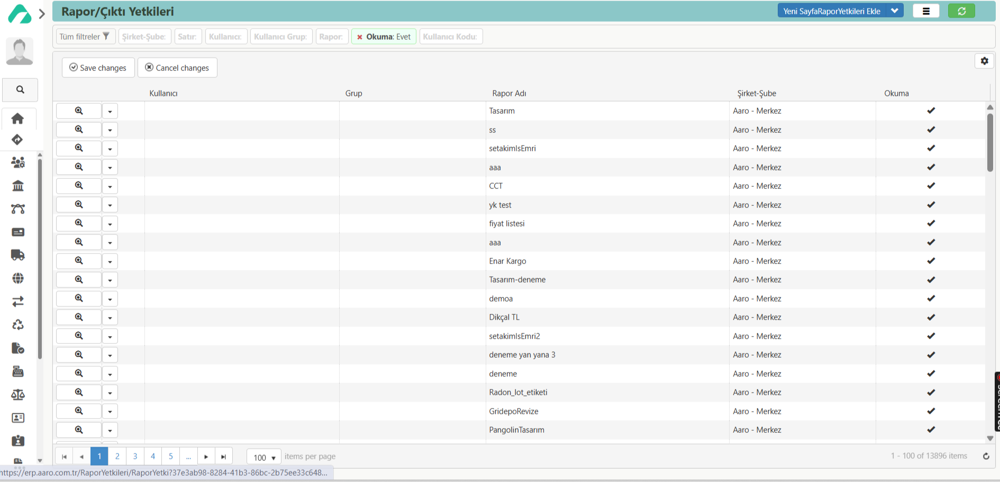

## RAPOR YETKİLERİ LİSTESİ

Solda bulunan paneldeki **‘Modüller’** sekmesinden **‘Ayarlar’** modülü seçilmektedir. Ayarlar modülü seçildikten sonra ‘Modül Sayfası’, ‘Kartlar’ bölümleri açılmaktadır. Bu bölümlerin içinden **‘Modül Sayfası’** seçilir. Çıkan ekranda **‘Kullanıcılar ve Yetkiler’** başlığından **‘Rapor Yetkileri Listesi’** butonu seçilir. Açılan sayfada **‘Yeni Sayfa Rapor Yetkileri Ekle’** butonuna tıklandığında **‘Rapor/Çıktı Yetki’** sayfası açılmaktadır. Pakete şirket ve şube tanımlıysa önce o seçilmektedir. Daha sonra **kullanıcı** ve **kullanıcı grup** ve **RaporID** seçilmektedir. **Okuma kutucuğu** işaretlenerek rapor/çıktıyı okuma yetkisi verilmektedir. 

Diğer seçenek ise **‘Çıktı Listesi’** nden raporu seçip, ‘Rapor Yetkileri’ bölümünde yer alan **‘Yeni Rapor Yetkilisi Ekle’** butonunu kullanarak rapor için okuma yetkisi tanımlamaktır. 