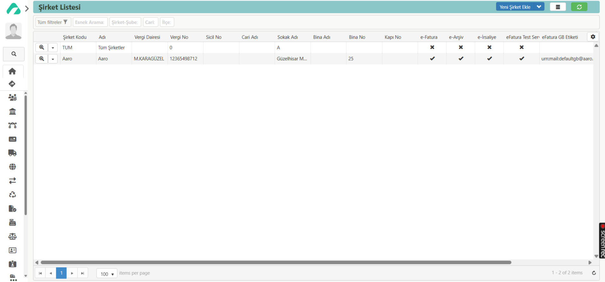

## ŞİRKET LİSTESİ

Solda bulunan paneldeki **‘Modüller’** sekmesinden **‘Ayarlar’** modülü seçilmektedir. Ayarlar modülü seçildikten sonra ‘Modül Sayfası’, ‘Kartlar’ bölümleri açılmaktadır. Bu bölümlerin içinden **‘Modül Sayfası’** seçilir. Çıkan ekranda **‘Genel Kartlar’** başlığından **‘Şirket Listesi’** butonu seçilir. Açılan sayfada **‘Yeni Şirket Ekle’** butonuna tıklandığında **‘Şirket (Yeni)’** sayfası açılmaktadır. Bu sayfada solda bulunan sekmelerdeki butonları kullanarak hızlı gezinme yapılabilmektedir. **‘Genel’** bölümünde ‘Şirket Kodu’ ve ‘Şirket Adı’ girilmektedir. ‘Detaylar’ bölümünde ‘Şirket Uzun Adı’ girilir. Sistem e-fatura ve çıktı listesi gibi şirket ünvanının yer aldığı alanlarda otomatik olarak bu adı kullanır. ‘Vergi Dairesi’ sistemde kayıtlı vergi dairelerinden (Listeden seç seçilerek tüm vergi daireleri görüntülenebilmektedir.) seçilebilmektedir. ‘Vergi Numarası’, ‘Sicil No’, 'Mersis No’ bilgileri girilmektedir. Cari kısmından şirketin cari kartı seçilmektedir. ‘Adres Bilgileri’ bölümünden sistemde kayıtlı ilçelerden (Listeden seç seçilerek tüm ilçeler görüntülenebilmektedir.) ‘İlçe’ seçilmektedir. ‘Sokak Adı’, ‘Bina Adı’, ‘Bina No’, ‘Kapı No’, ‘Posta Kodu’, ‘Telefon’, ‘Fax’, ‘Email’, ‘Web’ bölümleri doldurulmaktadır. ‘E-Posta’ başlığından, e-posta ve e-posta şifresi girilerek mail adresi ile sistem entegre olmakta ve bu şekilde mail gönderimleri sağlanmaktadır. 
‘E-Fatura Ayarları’ başlığı altında; E-Fatura ve E-Arşiv aktifleştirilebilir, Test API servisi kullanımı etkinleştirilebilir ve entegratör seçimi yapılabilir. Ayrıca kullanıcı adı ve şifre belirlenir; TCVKN, PK Etiketi ve GB Etiketi girilir. E-Fatura ve E-Arşiv için XSLT şablonu yüklenebilir.

‘E-İrsaliye Ayarları’ başlığında ise e-İrsaliye aktifleştirilebilir, e-İrsaliye’ye ait PK Etiketi ve GB Etiketi girilebilir ve XSLT şablonu yüklenebilir.

