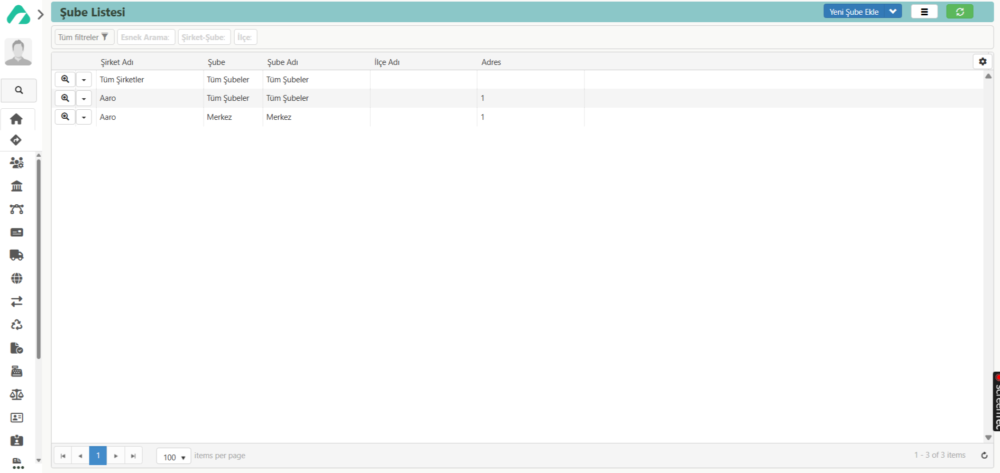

## ŞUBE LİSTESİ

Solda bulunan paneldeki ‘**Modüller**’ sekmesinden ‘**Ayarlar**’ modülü seçilir. Ayarlar modülü açıldıktan sonra, ‘**Modül Sayfası**’ ve ‘**Kartlar**’ bölümleri görüntülenir. Bu bölümler arasından ‘**Modül Sayfası**’ seçilir.

Açılan ekranda, ‘**Genel Kartlar**’ başlığı altında yer alan ‘**Şube Listesi**’ butonuna tıklanır. Karşınıza gelen sayfada ‘**Yeni Şube Ekle**’ butonuna tıklanarak ‘Şube (Yeni)’ sayfası açılır.

Bu sayfada, şubeye ait ‘**Kodu**’ ve ‘**Adı**’ alanları zorunlu olarak doldurulur. Ardından ‘Şirket’ seçimi yapılır ve ‘**Şube Uzun Adı**’ girilir. Şubenin ilçesi seçildikten sonra, adres bilgileri manuel olarak yazılır.

