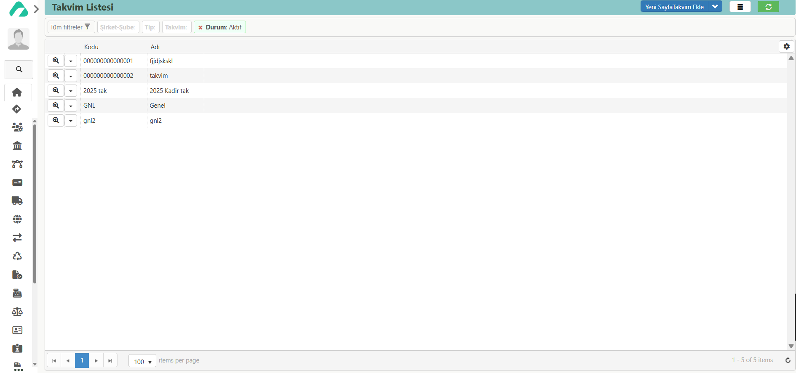

# Takvim

**Erişim Linki :** [erp.aaro.com.tr/Takvim/Liste](erp.aaro.com.tr/Takvim/Liste/)

## Ulaşım 

Sol sekmede, Aaro kullanıcı bilgilerinin hemen altında yer alan arama motoruna “takvim” yazarak hızlıca erişim sağlayabilirsiniz.

Alternatif olarak, sol menüden sırasıyla Personel > Modül Sayfası > Takvimler adımlarını izleyerek takvim ekranına ulaşabilirsiniz.

## Tanım 

Takvim, işletmenin planlama ve zaman yönetimini optimize etmek amacıyla oluşturulmuş bir araçtır.
Yıllık, aylık, haftalık ve günlük bazda işlemlerin takibini mümkün kılar.
Takvim aracılığıyla yapılan planlamalar; tarih, saat gibi temel bileşenler kullanılarak detaylandırılabilir.
Ayrıca takvim, diğer modüllerle entegre çalışarak üretim planlama gibi alanlarla uyum içinde kullanılabilir.
Belirli zaman aralıklarında geçerli olacak şekilde yapılan takvim tanımlamaları, değişken planlama ihtiyaçlarının etkili bir şekilde yönetilmesini sağlar. 

## Takvim Tanımlama 

**Kodu:** Takvim için geçerli olan kodu ifade eder.

**Adı:** Takvimin adını ifade eder.

**Durum:** Takvimin aktif ya da pasiflik durumunu ifade eder.

**Tip:** Takvimin tipini ifade eder.

### Günleri Hızlı Ayarla 

**Takvim** Günlerini ayarlacağımız takvimin seçimini ifade eder.

**Başlangıç Tarihi** Takvimin geçerli olacağı başlangıç tarihini ifade eder.

**Bitiş Tarihi:** Takvimin geçerli olacağı bitiş tarihini ifade eder.

Günlerin yanındaki kutucuklardan "Resmi tatil", "Hafta sonu" ve "Normal gün" seçeneklerini seçerek, günlerin mesai saatlerini belirleyebilirsiniz. Sistem, dakika bazında çalışmaktadır.

**Baş. Saat:** Mesainin başlayacağı saati ifade eder.

Bilgileri doldurduktan sonra "**Kaydet**"** diyerek takvim kaydınınızı tamamlayabilirsiniz.

### Takvim Üzerinden Günleri Ayarla

Hafta, ay, yıl ve tarih filtrelemeleri yaparak takvimi açabilirsiniz; yıl seçeneğinden istediğiniz yılı seçebilirsiniz. 
Çalışma saatlerini dakika bazında yazarak, günler için geçerli olan dakikayı girebilirsiniz. 
"Resmi Tatil", "Normal" ve "Hafta Sonu" seçeneklerinden seçim yaparak, günlerin üzerine tıklandığında günün özelliği tanımlanır.
Örneğin; Normal günler belirtilmek istendiğinde;
Normal Gün 540 dk seçeneği seçildikten sonra takvim üzerinden Pazartesi, Salı, Çarşamba, Perşembe, Cuma günlerine tıklayarak normal gün, 540 dk çalışma saati olarak tanımlanır.

### Üretim Planlamada Takvim

Üretim planlamada geçerli olacak takvimi tanımlamamız gerekmektedir.

Ayarlar -> Parametre Listesi -> Yeni Parametre Ekle -> Parametre: Uretim_UretimPlanTakvimi -> Değer: Geçerli olacak takvimi ifade eder.
Kaydet diyerek üretim için geçerli olacak takvimin tanımlaması tamamlanır.

