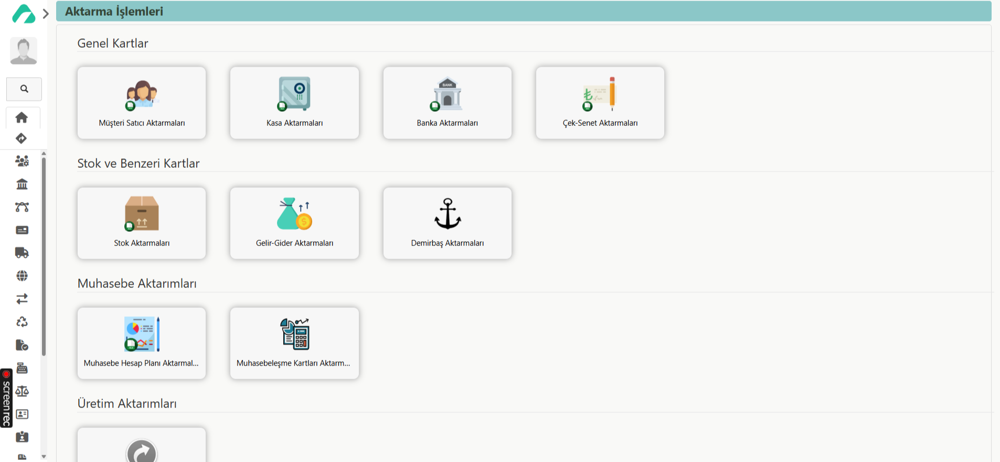

## VERİLERİ DIŞARIDAN AKTARMA

AARO Muhasebe ve Üretim programını kullanmaya başlarken ilk olarak kullanılacak modül, Ayarlar modülüdür.
Kullanıma, sistemde ihtiyaç duyulan verilerin aktarımıyla başlanır. Bu süreçte amaç; verileri tek tek kartlar aracılığıyla girmek yerine, Excel şablonu kullanarak toplu bir şekilde sisteme aktarmaktır.

Verileri AARO’ya aktarmak için, sol tarafta bulunan paneldeki ‘**Modüller**’ sekmesinden ‘**Ayarlar**’ modülü seçilir. Ayarlar modülü açıldığında, ‘**Modül Sayfası**’ ve ‘**Kartlar**’ *olmak üzere iki bölüm görüntülenir. Bu bölümler arasından ‘**Modül Sayfası**’ seçilir.

Açılan ekranda, ‘**Ayarlar**’ başlığı altında yer alan ‘**Dışarıdan Aktarma**’ butonuna tıklanır. 

Modüller Sekmesi -> Ayarlar  -> Modül Sayfası -> Ayarlar başlığı altındaki **Dışarıdan Aktarma** 

Dışarıdan aktarma butonuna tıklanıldığında ise **‘Aktarma İşlemleri’** sayfası açılır. Burada Genel Kartlar, Stok vb. Kartlar, Muhasebe Aktarımları, Hareketler ve Diğer başlıkları altında bulunan butonlar ile mevcutta bulunan bilgilerin sisteme aktarımı sağlanmaktadır. Sıklıkla kullanılan aktarımlar cari ve stok aktarımlarıdır. Diğer aktarımlar da stok ve cari aktarımlarına benzer şekilde yapılabilmektedir. 
