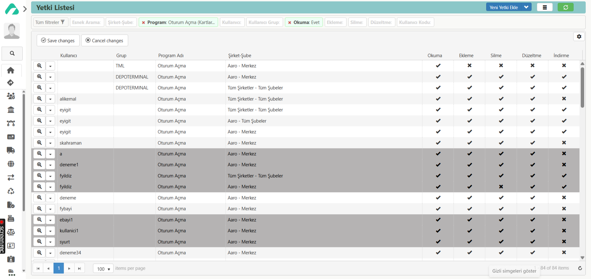

## YETKİ LİSTESİ

Solda bulunan paneldeki “**Modüller**”** sekmesinden “**Ayarlar**” modülü seçilir. Ayarlar modülü açıldığında, “**Modül Sayfası**” ve “**Kartlar**” bölümleri görüntülenir. Bu bölümlerden “**Modül Sayfası**” seçilir.

Açılan ekranda, “**Kullanıcılar ve Yetkiler**” başlığı altındaki “**Yetki Listesi**” butonuna tıklanır. Ardından açılan sayfada “**Yeni Yetki Ekle**” butonuna tıklanarak “**Yetki**” sayfası açılır.

Eğer lisansa şirket ve şube tanımlıysa, öncelikle bunlar seçilir. Daha sonra yetkinin kullanıcı mı yoksa kullanıcı grubu için mi tanımlanacağı belirlenir.

Kullanıcı seçilirse, tanımlanacak yetkiler sadece o kullanıcıya ait olur.

Kullanıcı grubu seçilirse, yetkiler gruptaki tüm kullanıcılara uygulanır.

Yetkinin kime ait olacağı belirlendikten sonra ilgili kullanıcı ya da kullanıcı grubu seçilir. Ardından ProgramID belirlenir ve ilgili program için verilmesi istenen okuma, ekleme, silme, düzeltme, indirme yetkileri işaretlenir.

Bu şekilde, her bir programa kimin hangi yetkilere sahip olacağı tek tek tanımlanabilir.

Ayrıca, Yetki Listesi sayfasındaki filtre bölümünden:

Şirket-şube ve kullanıcı grubu seçilerek, grubun hangi programda hangi yetkilere sahip olacağı toplu olarak düzenlenebilir.

Şirket-şube ve kullanıcı seçilerek, ilgili kullanıcının programlardaki yetkileri de toplu şekilde düzenlenebilir.
