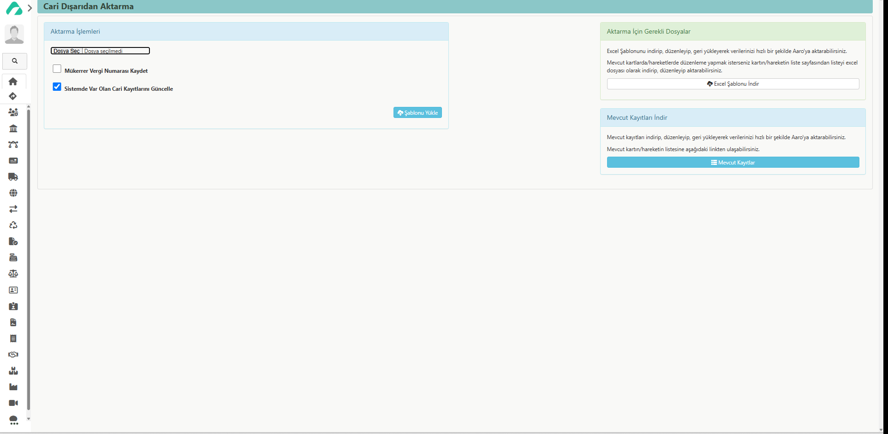

## CARİ AKTARIMI

Bir firma ilk işlem olarak carilerini ve stoklarını tanımlayarak başlamaktadır. Cariler tanımlanırken **‘Ayarlar’** başlığının altında bulunan **‘Dışarıdan Aktarma’** butonuna tıklandığında **‘Müşteri/Satıcı Aktarmaları’** sayfası seçilmelidir. Excel şablonu indirilmelidir. Açılan sayfada sağ tarafta bulunan ‘cari kodu, cari adı, cari tipi, vergi dairesi adı, vergi numarası gibi zorunlu bilgileri ve vade, fiyat listesi cari grup kodu, muhasebeleşme kodu, muhasebeleşme adı, carileri kategorilendirmek amacıyla altı tane kod, carileri etiketlemek amacıyla beş etiket, şirket kodu, şube kodu, şablon kodu, durum gibi zorunlu olmayan bilgileri’ içeren Excel şablon formatındaki cari bilgileri düzenlenerek sisteme yükleme yapılabilmektedir. Yükleme yapılmadan önce **‘Mükerrer Vergi Numarasını *Kaydet*’** kutucuğunu işaretleyerek mükerrer vergi numarası kaydedebilmekte ve **‘Sistemde Var Olan Cari Kayıtlarını Güncelle’** kutucuğuna tıklayarak sistemde var olan cari kayıtları güncellenebilmektedir. 

Satıcı Aktarımları’** butonuna tıklandığında **‘Müşteri/Satıcı Aktarma İşlemleri’** sayfası açılmaktadır. Bu sayfada **‘Genel’** başlığının altında bulunan *‘Müşteri/Satıcı Kartı Aktarma’** butonuna tıklanır. Açılan sayfada sağ tarafta bulunan ‘cari kodu, cari adı, cari tipi, vergi dairesi adı, vergi numarası gibi zorunlu bilgileri ve vade, fiyat listesi cari grup kodu, muhasebeleşme kodu, muhasebeleşme adı, carileri kategorilendirmek amacıyla altı tane kod, carileri etiketlemek amacıyla beş etiket, şirket kodu, şube kodu, şablon kodu, durum gibi zorunlu olmayan bilgileri’ içeren Excel şablonu indirilerek cari bilgileri bu formatta düzenlenerek sisteme yükleme yapılabilmektedir. Yükleme yapılmadan önce **‘Mükerrer Vergi Numarasını *Kaydet*’** kutucuğunu işaretleyerek mükerrer vergi numarası kaydedebilmekte ve **‘Sistemde Var Olan Cari Kayıtlarını Güncelle’** kutucuğuna tıklayarak sistemde var olan cari kayıtları güncellenebilmektedir.

Detaylar başlığı altında bulunan **‘Adres Aktarma’** butonuna tıklanarak açılan ekranda sağ tarafta bulunan ‘cari kodu, adres adı, sokak adı gibi zorunlu bilgileri ve bina adı, bina numarası, kapı numarası, posta kodu, ilçe adı, il adı, ülke adı, 3 adet telefon numarası, fax, email, web adresi, enlem, boylam ve durum gibi zorunlu olmayan bilgileri’ içeren Excel şablonu indirilerek cari adres bilgileri bu formatta düzenlenerek sisteme yükleme yapılabilmektedir. Yükleme yapılmadan önce **‘Sistemde Var Olan Cari Adres Kayıtlarını Güncelle’** kutucuğuna tıklayarak sistemde var olan cari adres kayıtları güncellenebilmektedir. 

Detaylar başlığı altında bulunan **‘İlgili Aktarma’** butonuna tıklanarak açılan ekranda sağ tarafta bulunan ‘cari kodu, ilgili adı, gibi zorunlu bilgileri ve telefon numarası, fax, email, iki adet not, unvan, doğum tarihi ve durum gibi zorunlu olmayan bilgileri’ içeren Excel şablonu indirilerek cari ilgili bilgileri bu formatta düzenlenerek sisteme yükleme yapılabilmektedir. Yükleme yapılmadan önce **‘Sistemde Var Olan Cari Adres Kayıtlarını Güncelle’** kutucuğuna tıklayarak sistemde var olan cari ilgilinin kayıtları güncellenebilmektedir. 

**‘Devir ve Hareketler’** başlığı altında bulunan **‘Devir Aktarma’** butonuna tıklanarak açılan ekranda sağ tarafta bulunan ‘cari kodu, tutar gibi zorunlu bilgileri ve döviz kodu, döviz tutarı, vade gibi zorunlu olmayan bilgileri’ içeren Excel şablonu indirilerek devir bilgileri bu formatta düzenlenerek sisteme yükleme yapılabilmektedir. Yükleme yapılmadan önce tarih, şirket şube seçilmekte ve **‘Sistemde Var Olan Cari Devir Kayıtlarını Güncelle’** kutucuğuna tıklayarak sistemde var olan cari devir kayıtları güncellenebilmektedir. 

En sık kullanılan cari aktarma işlemleri bunlardır. Bu işlemler dışında muhasebeleşme kartları, banka hesap gibi bilgiler de benzer şekillerde sisteme aktarılabilmektedir. 