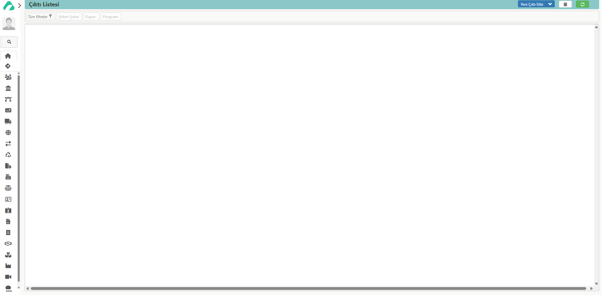

## ÇIKTI LİSTESİ 

Solda bulunan paneldeki **‘Modüller’** sekmesinden **‘Ayarlar’** modülü seçilmektedir. Ayarlar modülü seçildikten sonra ‘Modül Sayfası’, ‘Kartlar’ bölümleri açılmaktadır. Bu bölümlerin içinden **‘Modül Sayfası’** seçilir. Çıkan ekranda **‘Ayarlar’** başlığından **‘Çıktı Listesi’** butonu seçilir. Açılan sayfada **‘Yeni Çıktı Ekle’** butonuna tıklandığında firmaların teklif formu gibi kullanmakta oldukları formlar sisteme **‘Tasarla’** butonu ile eklenmektedir. 

Firmaya özel form tasarımlarının oluşturulduğu bölümdür. Bu sayede çalışanların alıştıkları düzendeki formları kullanmaları sağlanmaktadır.