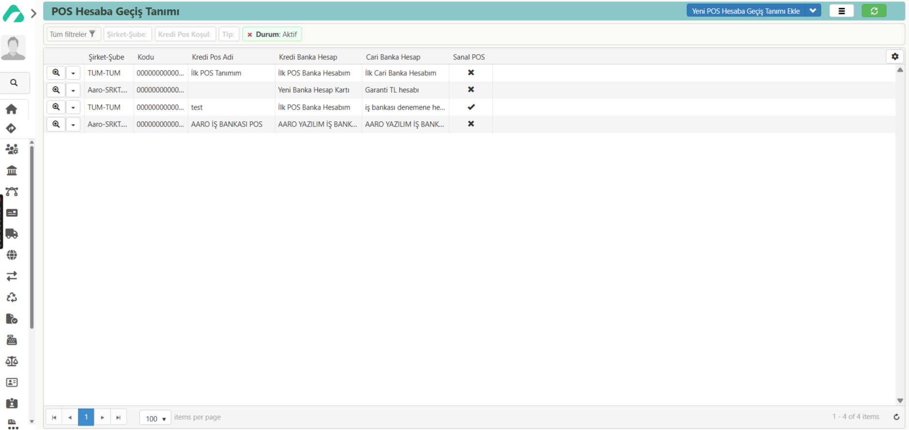

# POS Hesaba Geçiş Tanımı

**Erişim Linki :** [erp.aaro.com.tr/KrediPosKosul/Liste](erp.aaro.com.tr/KrediPosKosul/Liste)

### Ulaşım 

- Sol sekmede Aaro kullanıcı bilgilerinin hemen altında yer alan arama motorundan "pos" şeklinde aratarak ulaşım sağlayabilirsiniz.
- Sol menüden Banka -> Kartlar -> POS Hesaba Geçiş Tanımı Listesi üzerinden ulaşım sağlayabilirsiniz.

### Tanım

Pos hesaba geçiş tanımı hareketleri, pos cihazları aracılığıyla yapılan işlemlerin banka hesaplarına yansıma sürecidir. 
İşte bu süreci detaylandıran tanım:

- Müşteri, kredi kartı veya banka kartı ile pos cihazında ödeme yapar. 
- Pos cihazı, işlem bilgilerini bankaya ileterek onay alır ve ödeme işlemini tamamlar. 
- Gün sonunda pos cihazı, tüm işlemleri toplu olarak bankaya gönderir. 
- Banka, bu işlemleri kontrol ederek doğrular ve işletmenin hesabına aktarır. 
- İşlemler hesaba geçtikten sonra banka, komisyon kesintilerini yaparak kalan tutarı işletmenin hesabına yatırır. 
- İşletme, banka tarafından gönderilen dekont ve raporlarla işlemleri takip eder ve muhasebe kayıtlarını günceller.

Bu süreç, pos cihazı ile yapılan ödemelerin işletme hesaplarına güvenli ve düzenli bir şekilde geçmesini sağlar.

### Ek Özellikler 

- Sayfanın üst kısmında bulunan [Filtreleme](../TemelOzellikler/SayfaKisitlari.md) özelliği ile gelen veriyi istediğiniz şekilde sınırlandırabilirsiniz.
- Sayfadaki listeyi [Özel Listeleme](../TemelOzellikler/ListeNesnesi.md) sıralayabilir, yeniden boyutlandırabilir ve sayfa sayfa görüntüleyebilirsiniz.

## Yeni POS Hesaba Geçiş Tanımı Ekle

**Kodu:** Banka için geçerli olan kodu ifade eder. 

**Adı:** Bankanın adını ifade eder.

**Şirket-Şube:** Şirket-Şube tanımlıysa hangi şirker-şube olacağını ifade eder.

**Durum:** Bankanın aktif ya da pasif olma durumunu ifade eder. 

**Tip:** Bankanın tipini ifade eder. 

**Kredi Hesap:**

**Cari Hesap:**

**Taksit GelGid:**

**Puan GelGid:**

**Diğer GelGid:**

**Sabit Masraf GelGid:**

**Yuvarlama İlk Vadede:**

**Aşağıda değiştirilen değerler tüm taksit seçenekleri için otomatik uygulanır.**

**Min Taksit:**

**Mak Taksit:**

**Vade Aralığı:**

**Vade Tip:**

**Taksit Kom.**

**Puan Kom.**

**İşlem Kom.**

**Sabit Mas. Oran:**

## Kaydetme ve Silme

- Doldurulması gereken alanlar girildikten sonra sağ alt köşede bulunan *Kaydet* butonuna tıklayarak Pos Hesabı kartı açma işleminizi tamamlayabilirsiniz.
- Kayıtlı bir kartı silmek için sol altta bulunan belge sil butonuna tıklayabilirsiniz.

### Ek İşlem Butonu

- Sayfanın sağ üst köşesinde bulunan, alt alta üç çizgi şeklindeki düğme ile ek işlemlere erişebilirsiniz.

- [Ana Sayfaya Kısayol Olarak Ekle](../TemelOzellikler/KisaYollaraEkleme.md)

