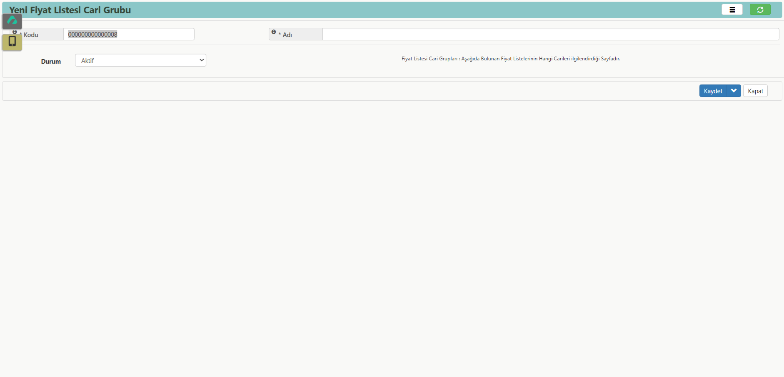

# Cari Fiyat Grubu

**Erişim Linki :** [erp.aaro.com.tr/FiyatListesiCariGruplari/Kalem](erp.aaro.com.tr/FiyatListesiCariGruplari/Kalem)

## Ulaşım 

- Sol sekmede Aaro kullanıcı bilgilerinin hemen altında yer alan arama motorundan "fiyat" aratarak ulaşım sağlayabilirsiniz.
- Sol menüden Satın Alma -> Kartlar -> Fiyat Listeleri(Alış) -> Bir Fiyat Listesi(büyütece ya da çift tıklayarak) -> Cari Grupları Listesi şeklinde ulaşım sağlayabilirsiniz.
- Sol menüden Satış Pazarlama -> Kartlar -> Fiyat Listeleri(Satış) -> Bir Fiyat Listesi(büyütece ya da çift tıklayarak) -> Cari Grupları Listesi şeklinde ulaşım sağlayabilirsiniz.
- Sol menüden Müşteri&Satıcı -> Kartlar -> Müşteri/Satıcı Kartı Listesi -> Herhangi bir Cari Kartı (büyütece ya da çift tıklayarak) -> Gelişmiş -> Fiyat Grup şeklinde ulaşım sağlayabilirsiniz.

## Tanım

Cari fiyat grubu, müşterilere veya müşteri segmentlerine özel fiyatlandırma yapma imkanı sağlayan bir özelliktir. 
Bu özellik, her bir müşterinin alışveriş davranışına, satın alma geçmişine veya anlaşmalara göre farklı fiyat listeleri oluşturulmasına olanak tanır.

Cari fiyat grupları sayesinde işletmeler, farklı müşteri gruplarına, ürün kategorilerine veya satış dönemlerine göre esnek fiyatlandırma stratejileri uygulayabilir. 
Bu durum, rekabetçi fiyatlar sunarak müşteri memnuniyetini artırır ve satışları destekler.

- Müşteri bazında farklı fiyatlandırma uygulama imkanı.
- Farklı müşteri grupları (örneğin, toptan alıcılar, perakende müşteriler) için özel fiyatlar.
- Pazar koşullarına göre dinamik fiyatlandırma yapabilme.
- Müşteri sadakatini artırmak için özel kampanya ve indirimler yapabilme.

## Fiyat Listesi Cari Grupları 

- Fiyat Listeleri kısmında cariler için geçerli olacak fiyat listelerini ve iskonto oranları görüntülenir.
- Cari Listesi kısmında ise fiyat listelerinde görünen listeler ve iskonto oranlarının geçerli olacağı cariler görüntülenir. 

### Yeni Fiyat Listesi Cari Grubu 

**Kodu:** Fiyat listesi cari grubunun kodunu ifade eder. Bir kod oluşturabilir ya da sistemin verdiği otomatik kodu kullanabilirsiniz.

**Adı:** Fiyat listesi cari grubunun adını ifade eder. 

**Durum:** Fiyat listesi cari grubunun aktif veya pasif durumunu ifade eder. Pasif hale getirmek istediğinizde, buradan "Durum: Pasif" seçeneğini kullanarak işlemi gerçekleştirebilirsiniz.

### Fiyat Listesi Ekleme 

**Durum:** Fiyat listesinin aktif veya pasif durumunu ifade eder. Pasif hale getirmek istediğinizde, buradan "Durum: Pasif" seçeneğini kullanarak işlemi gerçekleştirebilirsiniz.

**Fiyat Listesi Cari Grubu:** Üzerinde çalıştığımız fiyat listesi cari grubu otomatik seçili gelir.

**Liste:** Fiyat listesi cari grubunda kullanacağımız fiyat listesini ifade eder, fiyat listesi seçimi yapmamız gerekmektedir.
