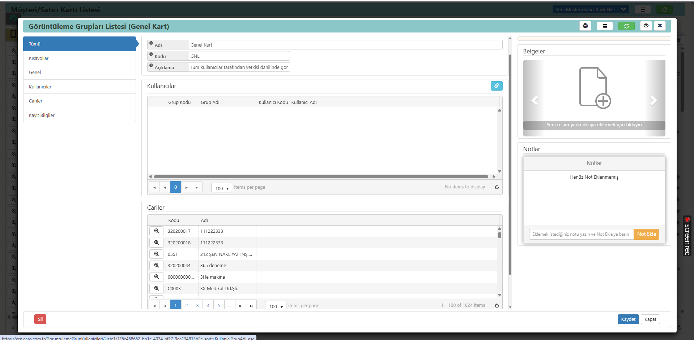

## Cari Görüntüleme (Cari Grup Kısıtlaması)

Cari görüntüleme özelliği, müşteri ve satıcı kartlarının belirli kullanıcılar tarafından görüntülenmesini veya erişilmesini kısıtlamak için kullanılan bir araçtır.
Bu özellik, cari grupları aracılığıyla yetkilendirme yaparak hassas müşteri ve satıcı bilgilerinin korunmasını sağlar.

Cari görüntüleme (cari grup kısıtlaması) kullanımları:
    - Veri Güvenliği: Hassas müşteri ve satıcı bilgilerinin yetkisiz erişime karşı korunması.
    - Yetkilendirme: Belirli kullanıcıların veya grupların sadece yetkili oldukları cari kartlarını görüntüleyebilmesi.
    - İç Kontrol: Cari kart bilgilerine erişimin denetlenmesi ve izlenmesi.

Örneğin:
Bir şirketin satış departmanında çalışan bir kullanıcı, sadece kendi sorumlu olduğu müşteri kartlarını görüntüleyebilirken, finans departmanında çalışan bir kullanıcı tüm müşteri ve satıcı kartlarını görüntüleyebilir.
Bu sayede, her kullanıcının sadece işiyle ilgili bilgilere erişmesi sağlanır ve veri güvenliği artırılır.

### Cari görüntüleme (cari grup kısıtlaması) nasıl yapılır?

1. Bu işlemi gerçekleştirmek için görüntüleme grup yetkisinin açık olması gerekmektedir.
2. Daha sonrasında herhangi bir müşteri-satıcı kartı açılır.
3. Aşağıda bulunan görüntüleme grupları satırından eklemek istediğimiz isim verilir.
4. Görüntüleme grubunun detayları girildikten sonra kayıt işlemi gerçekleştirilir.
5. Oluşturulan görüntüleme grubu içerisinden kullanıcılar ve cariler seçilir.

**Not:** En az iki tane görüntüleme grubu oluşturulması önerilir. Bir grup, cari kart bilgilerine erişimi kısıtlanacak kullanıcılar için, diğer grup ise herhangi bir kısıtlama uygulanmayacak kullanıcılar için kullanılmalıdır. Bu sayede, yetkilendirme işlemleri daha etkin bir şekilde yönetilebilir.
