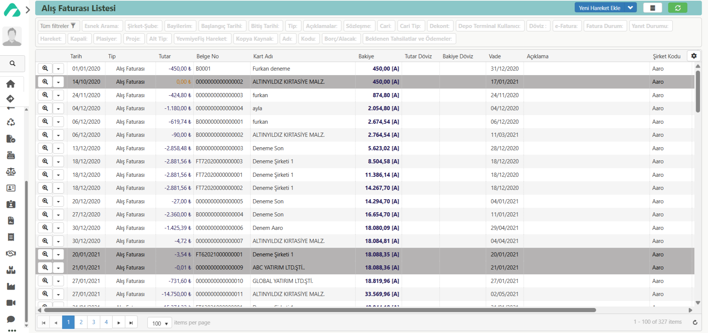

# Fatura Listesi (Alış)
**Erişim Linki :** https://erp.aaro.com.tr/AlisFaturasiListe/Liste

Alış fatura listesi, bir işletmenin tarafına düzenlenen tüm faturaları içeren, fatura numaraları, tarihleri ve tutarları gibi bilgileri içeren bir dökümdür. 
Bu liste, mali kayıtların takibi ve denetimi için kullanılır.

Burada alış faturalarımızı görüntüleyebilir, filtreleme yapabilir, hareket ekleyebiliriz.
## Yeni Hareket Ekle

- [Alış Faturası](../TemelHareketler/AlisFaturasi.md)
- [Alış İrsaliyesi](../TemelHareketler/AlisIrsaliyesi.md)
- [Alış İade Faturası](../TemelHareketler/AlisIadeFaturasi.md)
- [Alınan Teklif Hareketleri](../TemelHareketler/AlinanTeklifHareketleri.md)
- [Verilen Sipariş Hareketleri](../TemelHareketler/VerilenSiparisHareketleri.md)
- [Satın Alma Talep Hareketleri](../TemelHareketler/SatinAlmaTalepHareketleri.md)
- [Devir](../TemelHareketler/Devir.md)
- [Karma Transfer Hareketi](../TemelHareketler/KarmaTransferHareketi.md)

## Ek İşlemler

- Ana Sayfaya Kısayol Olarak Ekle: Ana sayfamıza hızlı erişim sağlayabilmek için kısayollarımıza ekleyebiliriz. [Anasayfaya Kısayol Olarak Ekle](../TemelOzellikler/KisaYollaraEkleme.md)
- Toplu Değiştir: Burada cari hareketlerinde toplu değişiklik yapabilirsiniz. [Toplu Değiştir](../TemelOzellikler/TopluDegistir.md)
- Grid Sütunları Ayarla: Burada kartın detaylarının görünümünde değişiklikler yapabilirsiniz. [Grid Sütunları Ayarla](../TemelOzellikler/GridSutunAyarlari.md)
