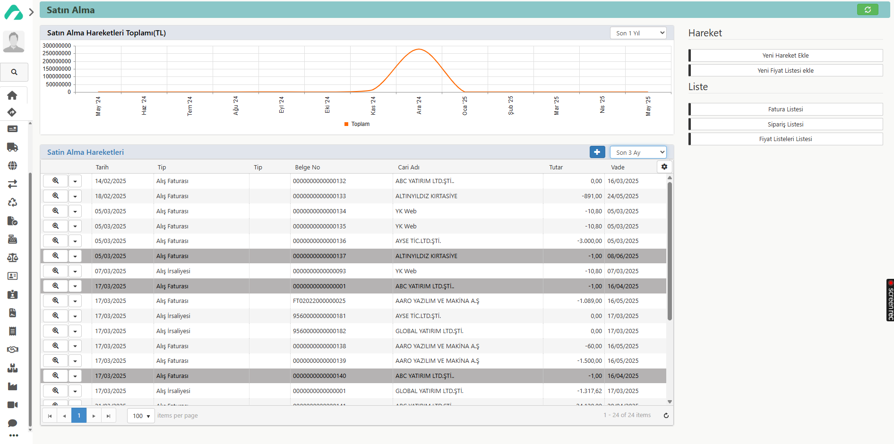

# Satın Alma Modülü

**Erişim Linki :** [erp.aaro.com.tr/SatinAlmaModulu](erp.aaro.com.tr/SatinAlmaModulu)

Bu modülde, satın alma sürecinin tüm aşamalarını -talepten fatura ödemesine kadar- takip edebilirsiniz. Talep toplama, sipariş verme, irsaliye ve fatura işlemlerinizi buradan yapabilirsiniz. Satın alma modülümüz, satın alma sürecindeki her aşamayı yönetmek için kullanılmaktadır.

İşletmenizin talep toplama, sipariş oluşturma, siparişi irsaliyeleştirme ve faturalaştırma işlemlerini bu bölümden gerçekleştirebilirsiniz. Satın alma aşamalarınızı izleyebilir ve kaydedebilirsiniz. Bu, siparişlerinizi kontrol etmeyi ve yönetmeyi kolaylaştırır.

Ayrıca, siparişlerinizle ilgili detaylı raporlar sunar. Bu raporlar, sipariş hareketlerinizi ve siparişlerinizin durumunu gösterir.

## Bu modülde yer alan işlemler;

### Satın Alma Aşamaları

- [Satın Alma Aşamaları](../SatinAlma/SatinAlmaAsamalari.md)

### Listeler 

- [Satın Alma Hareketleri Listesi](../SatinAlma/SatinAlmaHareketleriListesi.md)
- [Fatura Listesi](../SatinAlma/FaturaListesi.md)
- [Sipariş Listesi](../SatinAlma/SiparisListesi.md)
- [Fiyat Listeleri Listesi](../SatinAlma/FiyatListesi.md)
- [Sözleşme Listesi](../SatinAlma/SozlesmeListesi.md)

### Hareketler 

- [Satın Alma Hareket Oluştur](../SatinAlma/SatinAlmaHareketleriListesi.md)

### Raporlar

### Parametreler
