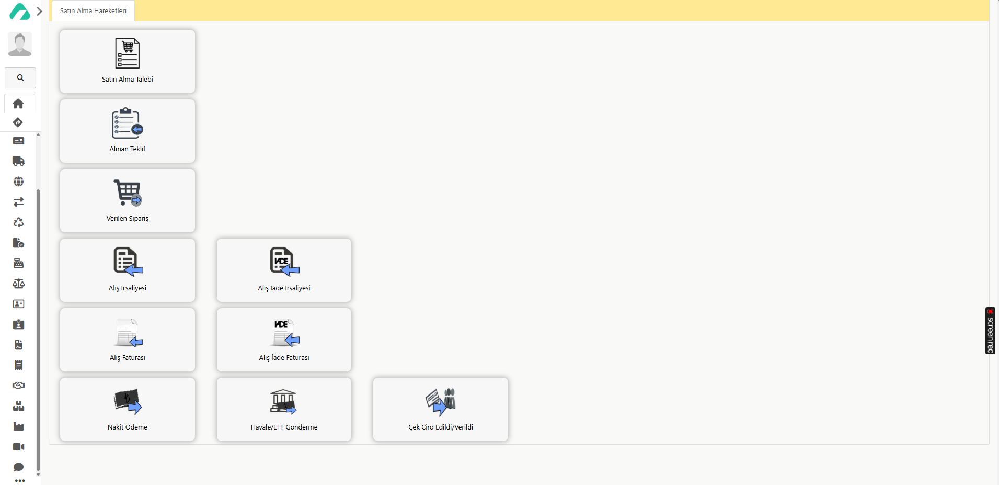

# Satın Alma Aşamaları:

Satın alma aşamaları, bir ürün veya hizmetin tedarik edilmesinden önceki ve sonraki tüm adımları kapsar. Bu süreç, talep aşamasıyla başlar. İşte bu aşamanın detayları:

**Talep:** İşletme, belirli bir ürün veya hizmete ihtiyaç duyar ve bu ihtiyacı belirler.

**Teklif Alma:** İhtiyaç duyulan ürün veya hizmet için farklı tedarikçilerden teklifler alınır. Teklifler, ürün veya hizmetin tanımı, miktarı, birim fiyatı, teslimat süresi ve diğer koşulları içerir.

**Teklif Değerlendirme:** Alınan teklifler, fiyat, kalite, teslimat şartları ve diğer faktörler dikkate alınarak değerlendirilir.

**Tedarikçi Seçimi:** En uygun teklifi sunan tedarikçi seçilir.

Bu aşamalar, ürün veya hizmetin tedarik edilmesi ve anlaşmanın sağlanması sürecinin temel adımlarını oluşturur.

Teklif almak için;
	- *Satın Alma -> Hareket Oluştur -> Alınan Teklif* şeklinde ilerleyebilirsiniz.

Aaro üzerinden teklif alma detaylarına linkten erişim sağlayabilirsiniz. [Teklif Alma](../TemelHareketler/AlinanTeklif.md)

Eğer teklif uygun bulunmazsa, tedarikçiden teklifi revize etmesi istenebilir veya farklı tedarikçilerden teklif alınabilir. Teklif onaylandığında, bir sonraki aşama olan sipariş aşamasına geçilir.

**Sipariş Aşaması:**

*Sipariş Verme:* İşletme, onaylanan teklif doğrultusunda tedarikçiye resmî bir sipariş verir. Sipariş formunu doldurur ve gönderir.

*Sipariş Onayı:* Tedarikçi, gelen siparişi inceleyip uygunluğunu onaylar. Bu aşamada bir sipariş numarası oluşturulur.

*Stok ve Üretim Kontrolü:* Sipariş edilen ürünlerin stok durumu kontrol edilir veya üretim süreci başlatılır.

Aaro sisteminde teklif onaylandıktan sonra, teklif detaylarına gidip "TEKLİFLEŞTİR" seçeneğini seçerek sipariş işlemini tamamlayabilirsiniz. Açılan ekranda, vade, belge tarihi ve belge numarası gibi bilgileri girebilir, ardından "*Kaydet*" diyerek siparişleştirme işlemini başarıyla tamamlayabilirsiniz.

Teklif alınmadan sipariş verildiyse;

*Satın Alma -> Hareket Oluştur -> Verilen Sipariş* şeklinde sipariş oluşturabiliriz.
Sipariş ekleme detaylarına linkten erişim sağlayabilirsiniz. [Sipariş Verme](../TemelHareketler/VerilenSiparis.md)

Siparişimiz hazırlandıktan sonra teslim alınması gereken sipariş için irsaliye oluşturmamız gerekmektedir.

İrsaliye, ürünlerin teslimatı yapılırken düzenlenen ve taşıma sürecinde ürünü tanımlayan belgedir.

	- Ürünler sevkiyata hazırlandığında, irsaliye hazırlanır. Bu belgede ürünlerin detayları, miktarı ve satıcı bilgileri yer alır.

	- Ürünler, irsaliye eşliğinde işletmeye gönderilir. Taşıyıcı firma veya kargo şirketi irsaliyenin bir kopyasını alır.

	- Ürünler işletmeye ulaştığında, alıcı irsaliyeyi kontrol eder ve teslim alındığını onaylar.

Aaro üzerinden irsaliye oluşturmak için;

Siparişimizin detaylarına girerek irsaliyeleştir seçeneğini seçerek irsaliyeleştirme işlemimizi başarıyla gerçekleştirebiliriz.
Burada açılan ekranda vade, belge tarihi ve belge numarası girebiliriz.

İrsaliye oluşturmak için;
	*Satın Alma -> Hareket Oluştur -> Alış İrsaliyesi* şeklinde ilerleyebiliriz.
Sipariş ekleme detaylarına linkten erişim sağlayabilirsiniz. [İrsaliye Oluşturma](../TemelHareketler/AlisIrsaliyesi.md)

Faturalandırma Süreci:

İrsaliyesini oluşturduğunuz siparişin bir sonraki aşaması faturalandırmadır. İrsaliye oluşturmadan fatura almak isterseniz, sipariş detaylarına **faturalaştır"** seçeneğini seçerek faturalaştırma işlemini gerçekleştirebilirsiniz. Açılan ekranda, vade, belge tarihi ve belge numarası gibi bilgileri girip *"*Kaydet*"* ile işlemi tamamlayabilirsiniz.

**Satın Alma İade İrsaliyesi:**

Satın alma iade irsaliyesi, ürünlerin fiziksel olarak geri gönderildiğini belgeleyen bir dokümandır. Bu irsaliye, ürünlerin geri taşınması sırasında düzenlenir ve teslim edilen ürünlerin iade sürecini takip etmek için kullanılır.

Bir işletme ürünü iade etmek istediğinde, genellikle önce bir iade talebi oluşturur. Bu talep onaylandıktan sonra işletme ürünü geri gönderir.

**Satın Alma İade İrsaliyesi Oluşturma:**

Satın alma iade irsaliyesi oluşturmak için şu adımları izleyebilirsiniz:

**Satın Alma** sekmesine gidin
**Hareket Oluştur** seçeneğini seçin.
**Alış İade İrsaliyesi** seçeneğini tıklayarak irsaliye oluşturun.
Fatura oluşturmak için;
	- *Satın Alma -> Hareket Oluştur -> Alış Faturası Listesi -> Yeni Hareket Ekle* şeklinde ilerleyebilirsiniz.
Fatura oluşturma detaylarına linkten erişim sağlayabilirsiniz. [Fatura Oluşturma](../TemelHareketler/AlisIadeIrsaliyesi.md)

### Faturalandırma:

* Kaydetme ve Detay Girişi: 

*"*Kaydet*"* butonuna bastığınızda, kalem ekleme, düzenleme ve sipariş detaylarını görme ekranlarına erişirsiniz.
Bu ekranlarda gerekli bilgileri kontrol edip onayladıktan sonra, *"*Kaydet*"* diyerek işlemi tamamlayabilirsiniz.

**"Fatura Gönder"** seçeneğine tıklayarak eklemeniz gereken detayları girebilirsiniz.
Faturanın ön izlemesini yaparak son kontrollerinizi sağladıktan sonra faturayı gönderebilirsiniz.

#### Satın Alma İade Faturası:
 İşletmenin satın aldığı bir ürünün iade edilmesi durumunda düzenlenir. Bu fatura, geri gönderilen ürünler için oluşturulur ve işletme ile tedarikçi arasındaki mali işlemleri düzeltir.

İşlem Süreci:

Ürünler, tedarikçi tarafından geri alındıktan ve incelendikten sonra bir **Satın Alma İade Faturası** kesilir.
Bu fatura, ilk alış faturasındaki hataları düzeltir ve işletmenin ödemesini uygun şekilde düzenler.

Satın alma iade faturası oluşturmak için:

*Satın Alma -> Hareket Oluştur ->
Alış İade Faturası* şeklinde ilerleyebilirsiniz.
Fatura oluşturma detaylarına linkten erişim sağlayabilirsiniz. [Fatura Oluşturma](../TemelHareketler/AlisIadeFaturasi.md)