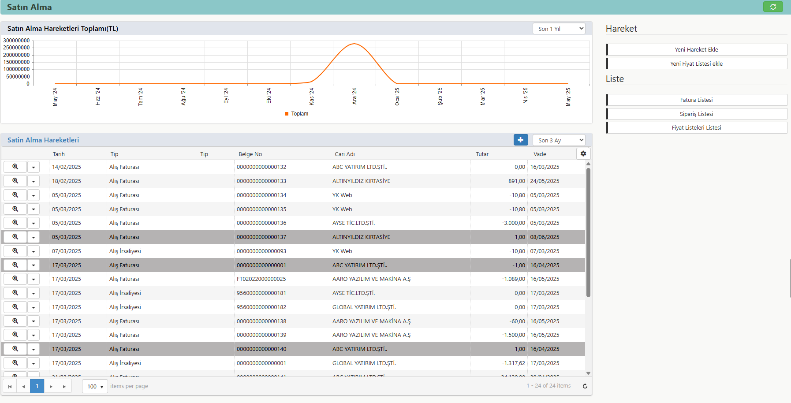

# Listeler 

- [Alış Faturası Listesi](../TemelHareketler/AlisFaturasi)
- [Alış İrsaliyesi Listesi](../TemelHareketler/AlisIrsaliyesi)
- [Verilen Sipariş Listesi](../TemelHareketler/VerilenSiparis)
- [Alınan Teklif Listesi](../TemelHareketler/AlinanTeklif)
- [Alış İade Faturası Listesi](../TemelHareketler/AlisIadeFaturasi)
- [Alış İade İrsaliyesi Listesi](../TemelHareketler/AlisIadeIrsaliyesi)
- [Alış Faturası Hareketleri](../TemelHareketler/AlisFaturasi)
- [Alış İrsaliyesi Hareketleri](../TemelHareketler/AlisIrsaliyesi)
- [Verilen Sipariş Hareketleri](../TemelHareketler/VerilenSiparis)
- [Alınan Teklif Hareketleri](../TemelHareketler/AlinanTeklif)
- [Alış İade Faturası Hareketleri](../TemelHareketler/AlisIadeFaturasi)
- [Alış İade İrsaliyesi Hareketleri](../TemelHareketler/AlisIadeIrsaliyesi)

Listelerden son 3 aya ait teklif, sipariş, irsaliye, fatura hareketlerimize ulaşım sağlayabiliriz.

Filtreme özelliği ile özel özelliklerde  tarihlere göre sıralama yapabilir; yeni hareket ekleyebilir, toplu değiştirme özelliği ile toplu değişiklik yapabiliriz.

Listeyi Excele aktarabilir, filtreleme seçeneklerimizi grid sütunlarından ayarlayabilir, ana sayfaya kısayol olarak ekleyebiliriz.
