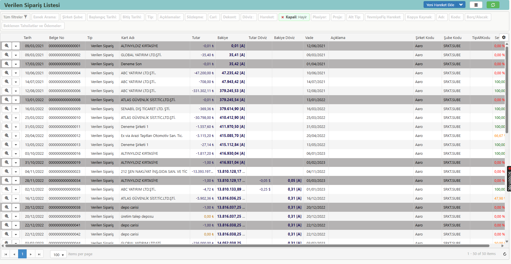

# Sipariş Listesi (Satın Alma)

**Erişim Linki :** [erp.aaro.com.tr/SiparisListe/Liste?TipID=10014,10017&TarihBas=!AyBasi(-3)&Kapali=false](erp.aaro.com.tr/SiparisListe/Liste?TipID=10014,10017&TarihBas=!AyBasi(-3)&Kapali=false)

Satın alma sipariş listesi, işletmenin tedarikçiye verdiği tüm siparişleri içeren. Sipariş numaraları, tarihleri, tedarikçi bilgileri, sipariş edilen ürün veya hizmetler ve miktarları gibi bilgileri içeren bir dökümdür. 
Bu liste, siparişlerin takibi ve yönetimi için kullanılır.

Bu listede tedarikçi siparişlerinizi görüntüleyebilirsiniz.

## Yeni Hareket Ekle

- [Alınan Sipariş](../TemelHareketler/AlinanSiparis.md)
- [Verilen Sipariş](../TemelHareketler/VerilenSiparis.md)
- [Alınan Teklif](../TemelHareketler/AlinanTeklif.md)
- [Verilen Teklif](../TemelHareketler/VerilenTeklif.md)
- [Satın Alma Talebi](../TemelHareketler/SatinAlmaTalebi.md)

## Ek İşlemler

- Ana Sayfaya Kısayol Olarak Ekle: Ana sayfamıza hızlı erişim sağlayabilmek için kısayollarımıza ekleyebiliriz. [Ana Sayfaya Kısayol Olarak Ekle](../TemelOzellikler/KisaYollaraEkleme.md)
- Toplu Değiştir: Burada cari hareketlerinde toplu değişiklik yapabiliriz. [Toplu Değiştir](../TemelOzellikler/TopluDegistir.md)
- Grid Sütunları Ayarla: Burada kartın detaylarının görünümünde değişiklikler yapabiliriz. [Grid Sütunları Ayarla](../TemelOzellikler/GridSutunAyarlari.md)
