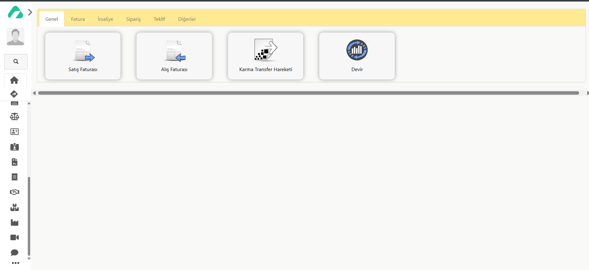

## Stok Hareketleri

### Genel

- [Satış Faturası](../TemelHareketler/SatisFaturasi.md)
- [Alış Faturası](../TemelHareketler/AlisFaturasi.md)
- [Karma Transfer Hareketi](../TemelHareketler/KarmaTransferHareketi.md)
- [Devir](../TemelHareketler/Devir.md)

### Fatura

- [Satış Faturası](../TemelHareketler/SatisFaturasi.md)
- [Alış Faturası](TemelHareketler/AlisFaturasi.md)
- [Satış İade Faturası](../TemelHareketler/SatisIadeFaturasi.md)
- [Alış İade Faturası](../TemelHareketler/AlisIadeFaturasi.md)

### İrsaliye

- [Satış İrsaliyesi](../TemelHareketler/SatisIrsaliyesi.md)
- [Alış İrsaliyesi](../TemelHareketler/AlisIrsaliyesi.md)
- [Satış İade İrsaliyesi](../TemelHareketler/SatisIadeFaturasi.md)
- [Alış İade İrsaliyesi](../TemelHareketler/AlisIadeIrsaliyesi.md)

### Sipariş

- [Alınan Sipariş](../TemelHareketler/AlinanSiparis.md)
- [Verilen Sipariş](../TemelHareketler/VerilenSiparis.md)

### Teklif

- [Alınan Teklif](../TemelHareketler/AlinanTeklif.md)
- [Verilen Teklif](../TemelHareketler/VerilenTeklif.md)

### Diğerleri

- [Depolar Arası Transfer](../TemelHareketler/DepolarArasiTransfer.md)
- [Depolar Arası Transfer (Doğrudan Sevk)](../TemelHareketler/DepolarArasiTransferDogrudanSevk.md)
- [Sayım Farkı İşlemi](../TemelHareketler/SayimFarkiIslemi.md)
- [Üretime Ham Madde Çıkışı](../TemelHareketler/UretimeHamMaddeCikisi.md)
- [Üretimden Mamul Giriş](../TemelHareketler/UretimdenMamulGiris.md)
- [Devir](../TemelHareketler/Devir.md)
- [Karma Transfer Hareketi](../TemelHareketler/KarmaTransferHareketi.md)
- [Kur Farkı Hareketi](../TemelHareketler/KurFarkiHareketi.md)
