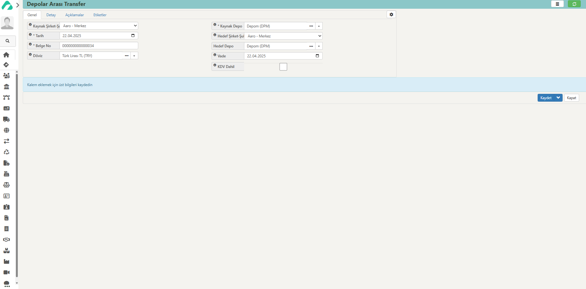

# Depolar Arası Transfer

**Erişim Linki :** [erp.aaro.com.tr/FaturaDepolarArasiTransfer](erp.aaro.com.tr/FaturaDepolarArasiTransfer)

## Ulaşım

- Sol sekmede Aaro kullanıcı bilgilerinin hemen altındaki arama motorundan "depo" şeklinde aratarak ulaşabilirsiniz.
- Sol menüden *Stok -> Hareket Oluştur -> Diğerleri -> Depolar Arası Transfer* şeklinde ulaşabilirsiniz. 
- Sol menüden *Satış & Pazarlama -> Hareket Oluştur -> Depolar Arası Transfer* şeklinde ulaşabilirsiniz. 

## Tanım

Depolar arası transfer, bir işletmenin çeşitli depoları arasında ürün veya malzemelerin taşınmasını ifade eder. 
Bu işlem, stok seviyelerini dengelemek, talebe hızlı yanıt vermek, lojistik süreçleri optimize etmek veya stratejik dağıtım kararlarını uygulamak amacıyla yapılır. 
Depolar arası transfer, envanter yönetimi açısından önemlidir ve ürünlerin doğru zamanda doğru yerde bulunmasını sağlar. 
Bu süreç, nakliye düzenlemeleri, envanter güncellemeleri ve kayıt tutma işlemlerini içerir. 
Böylece işletme, kaynaklarını daha verimli kullanabilir ve müşteri taleplerine daha hızlı yanıt verebilir.

## Genel 

**Kaynak Şirket-Şube:** Kartın ait olduğu şirket ve şubeyi belirtir. Hangi şirket-şubeden malzeme gönderimi yapılacak ise o şirketi-şubeyi seçelim.
	Şirket-Şube kullanım detayları için linke tıklayınız. [Şirket-Şube](../TemelOzellikler/SirketSubeKart.md)

**Tarih:** İşlemin yapıldığı tarihi belirtir.

**Belge No:** Belge numarasını ifade eder. Otomatik olarak sıradaki numara gelir. İstenilirse seri kullanılabilir.
**Girilmesi Zorunludur.**

**Vade:** Bu işlem için yapılması gereken süreyi ifade eder. 

**Döviz:** Bu işlemin çalıştığı döviz cinsini belirtir.

**KDV Dahil:** Kalemlerde birim fiyat ve tutarın 'KDV Dahil' olduğunu belirtir. KDV dahil kullanım detayları için linke tıklayınız.[KDV Dahil](../TemelOzellikler/KDVdahil.md)

**Kaynak Depo:** Transferin gerçekleşeceği depoyu ifade eder. Hangi depoya malzeme gönderimi yapılacak ise o depoyu seçelim.

**Hedef Şirket-Şube:** Transfer yapacağımız deponun hangi şirket-şube olduğunu ifade eder.

**Hedef Depo:** Transferin gerçekleşeceği depoyu ifade eder. Hangi depoya malzeme gönderimi yapılacak ise o depoyu seçelim.

***Kaydet* diyerek transferi gerçekleşecek malzemeler için kalem ekleme ekranına geçerek Kaydetme işleminizi tamamlayabilirsiniz.**

## Kalem Ekleme

- Yeni Stok Kalemi Ekle: Stok kalemi eklemek için burayı seçerek ekleme sağlayabilirsiniz.
- Yeni Gelirgider Kalemi Ekle: Gelir gider kalemi eklemek için burayı seçerek ekleme sağlayabilirsiniz.
- Yeni Demirbaş Kalemi Ekle: Demirbaş kalemi eklemek için burayı seçerek ekleme sağlayabilirsiniz.
- Siparişten Kalem Ekle: Sipariş için depolar arası transfer yapmamız gerekirse, siparişten kalem seçerek kalem ekleme işlemini gerçekleştirebiliriz.

- Kalem ekleme alanımızda eklememiz gereken bilgileri ekledikten sonra;
- Depolar arası transferde 1 kalem belirtilecekse *Kaydet* diyerek bir sonraki aşamaya geçebiliriz.
- Başka kalemlerde mevcut ise yukarıda aşamaları tekrar ederek yeni kalemleri ekleyebilirsiniz.

- Sağ üst köşede depolar arası transfere ait toplam fiyat kısımlarını bulunur;
- Toplam: Satış iade irsaliyesinin KDV hariç toplam tutarını içerir.

## Belge

Yapacağımız işlem için elimizde belgeler var ise jpg, png, pdf vb. formatlardaki belgeleri buraya yükleyebiliriz.
Buraya işlem esnasındaki görselleri yükleyebiliriz.

Belge eklemek için tıklayalım ;

- *Daha önce yüklediklerimden seç -> Belgeyi seç
-> İlişkilendir* şeklinde belge yükleme işlemimizi gerçekleştirebiliriz.
- *Yüklenecek belge veya resimleri seç -> Belgeyi ya da
 belgeleri seç -> Yükle* şeklinde belge yükleme işlemimizi gerçekleştirebiliriz.

Belge kullanım detayları için linke tıklayınız. [Belge](../TemelOzellikler/Belgeler.md)

## Notlar 

İşleme ait özel notlar ekleyebiliriz. Önemli bir detay varsa, bu ayrıntıları burada belirtebiliriz. Notların kullanım detayları için lütfen bağlantıya tıklayınız. [Notlar](../TemelOzellikler/Notlar.md)

## Kayıt Bilgileri

Kartın hangi kullanıcı tarafından ve hangi tarihlerde oluşturulduğu ve değiştirildiği bilgisini içerir.

Kart iş akış süreçlerine dahil edildiğinde hangi kullanıcı tarafından hangi tarihte onaylandığı bilgilerini içerir. 

## Kaydetme ve Silme

- Doldurulması gereken alanlar girildikten sonra sağ alt köşede bulunan *Kaydet* butonuna tıklayarak depolar arası transfer işleminizi tamamlayabilirsiniz.
- Kayıtlı bir kartı silmek için sol altta bulunan sil butonuna tıklayabilirsiniz.

## Yazdır

- Sayfanın sağ üstünde bulunan yazıcı sembolü ile sayfaya tanımlanan özel çıktı formatları ile farklı çıktılar alınabilir. 
- Kartta bulunan bilgilerin kullanıcının isteğine bağlı olarak özel tasarım ile yazdırılmasını sağlar.
- Birden çok çıktı tasarım yapılabilir ve değiştirilebilir.
- Kullanıcıya özel depolar arası transfer formu gibi farklı tasarımlar yapılabilir.
- Çıktı tasarımlarının her birine  ayrı ayrı yetkiler verilerek sadece istenilen kullanıcının belirli çıktılara ulaşması sağlanabilir.
- Çıktılar program üzerinden e-mail olarak gönderilebilir. 

## Düzenleme 

Depolar arası transfer işlemimizde herhangi bir düzeltme ya da ekleme yapmak için kalem işaretini seçerek açılan ekranda ekleme ve düzenlemeleri yapabiliriz.

## Ek İşlemler

Sayfanın sağ üst köşesinde bulunan, alt alta üç çizgi şeklindeki düğme ile ek işlemlere erişebilirsiniz.

- Yevmiye Fiş: Yevmiye fişi, işletmelerde gerçekleşen her türlü mali işlemin tarih, miktar ve açıklama bilgileri ile birlikte kaydedildiği muhasebe belgesidir.
- Kopyala: Verilen teklifi kopyalamak için kullanılır.
- Kur Güncelle: Kuru buradan güncelleyebiliriz.
- Tüm Kalemlerde Değiştir: Buradan depo, proje, sözleşme, vergi muafiyeti, vergilerin yenilenmesi, iskonto oranı, referans ithalat/ihracat, plasiyer ve referans teslim tarihi gibi bilgileri tüm kalemler için toplu olarak değiştirebilirsiniz.
- Döviz Türü Değiştir: Döviz türü değişikliği yapabiliriz.
- Depo Terminaline Aktar: 
- Görev Oluştur: Teklif için görev oluşturup, kişi atayabiliriz. Açıklama, tarih bitiş, hatırlatma süresi, yönetici, kullanıcı, tamamlanma tipi, tekrar şekli bilgilerini ekleyerek görev tanımlama işlemimizi gerçekleştirebiliriz.
- Görev Bağla: Açılan listedeki görevlerden bağlayacağımız, birleştireceğimiz görevi seçip, *Kaydet* diyerek görevi bağlayabiliriz.
- Siparişlerini Gör: 
- Grid Sütunları Ayarla: Burada kartın detaylarının görünümünde değişiklikler yapabilirsiniz.

# e-İrsaliye Gönderme

-Oluşturduğumuz depolar arası transferi kontrol edelim.
- Senaryo: e-İrsaliye
- Belge Tipi: Sevk
- BelgeSeriNo: Seri No, Foriba tarafından otomatik olarak verilecektir.
- Alıcı Adı: Alıcı cari burada gözükmektedir, cari adına tıklayarak cari kartına hızlı erişim sağlayabilirsiniz.
- Etiket: 
- Düzenlenme Tarihi: İrsaliyenin düzenlendiği tarihi belirtir.
- Sevk Tarihi: İrsaliye faturasını oluşturduğum ürünlerin sevk edileceği tarihi ifade eder.
- Dekont Açıklamalarını Gönder: Dekont açıklaması belirtmek istenilirse kutucuğu işaretleyerek açıklama ekleyebiliriz.
- Kalem Açıklamalarını Gönder: Kalemlerde açıklama belirtmek istenilirse kutucuğu işaretleyerek açıklama ekleyebiliriz.
- Stok Adı olarak Kalem Açıklamasını Kullan: Stok adı kalem açıklamasında kullanılmak istenilirse kutucuğu işaretleyebiliriz.
- Not: İrsaliyeye ait açıklamayı belirtir.
- Taşıyıcı VKN: Taşıyıcının firma ise vergi kimlik numarasını, şahıs ise TC Kimlik Numarası girileceğini ifade eder.
- Taşıyıcı Unvan: Taşıyıcı firma ise taşıyan kişinin ünvanının, şahıs ise adının girileceğini ifade eder.
- Plaka: Taşıma yapılan aracın plakasını ifade eder.

**e-İrsaliye Önizle diyerek bilgilerimizi önizlemesi gerçekleşen irsaliyeyi kontrolünü sağlayalım, bilgilerimizi teyit edip doğruluğundan emin olduktan sonra e-İrsaliye Gönder diyerek işlemimizi tamamlayalım.**
