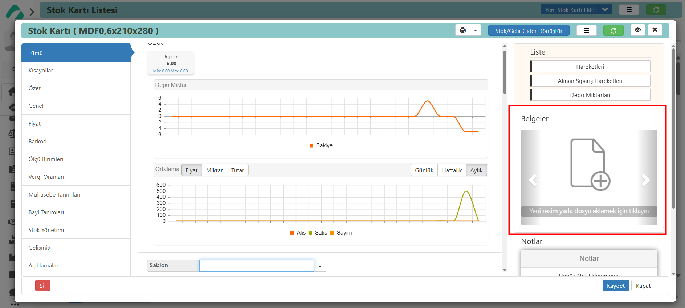

# Belgeler

Herhangi bir harekete veya karta, işlemle ilgili .jpg, .png veya .pdf formatlarında belgeler ekleyebilirsiniz.

Bu, işlem yapacak kişilerin detaylı bilgiye veya görsellere kolayca erişmesini sağlar. 
Ayrıca, işlem gerçekleşirken çekilen görselleri yükleyebilir ve siparişlerdeki sözleşmeleri ekleyebilirsiniz. 
Personel özlük dosyalarını ekleyerek verilerin kaybolmasını engeller ve ihtiyaç duyulduğunda hızlı erişim sağlar.
Örneğin, bir stok kartınızla ilişkili resim veya diğer belge uzantılarındaki dosyaları ekleyebilir ve görüntüleyebilirsiniz.

Belge eklemek için tıklayalım:

Daha önce yüklediklerimden seç → Belgeyi seç → İlişkilendir şeklinde belge yükleme işlemimizi gerçekleştirebiliriz.

Yüklenecek belge veya resimleri seç → Belgeyi ya da belgeleri seç → Yükle şeklinde belge yükleme işlemini gerçekleştirebiliriz.
*Kaydettikten sonra;

**İndir** Belgeyi cihazınıza indirmek için kullanılır. İndir işaretine basarak dosyayı indirebilirsiniz.

**Belge Kartını Aç** Seçili olan belgeye ait bilgilerin güncellenmesini sağlar. Düzenle işaretine basarak değişiklik yapabilirsiniz.

**Tam Ekran** Görsele tıklayarak tam ekran görüntüleyebiliriz.

**Yeni Belge Ekle** Yeni bir belge sayfası eklemenizi sağlar. Görseli yana kaydırıp belge eklemek için tıklayınız.
