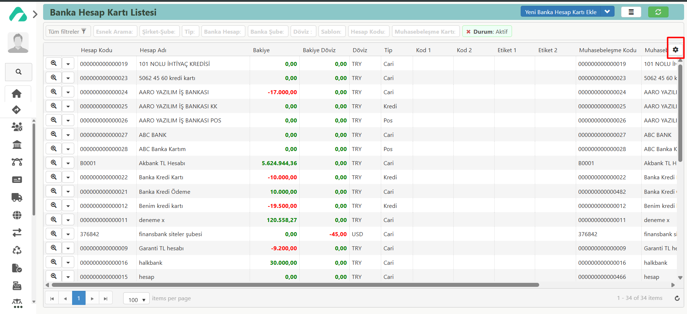
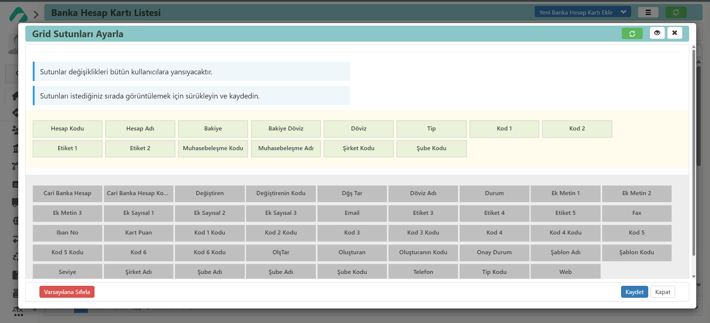

## Grid Sütunları Ayarlama

Grid sütunlarını ayarlamak, bir tablo veya veri görünümündeki sütunların sırasını düzenlemeyi ifade eder. 
Bu ayarlamalar, verilerin daha okunabilir ve kullanıcı dostu bir şekilde sunulmasını sağlar.

Grid Sütunlarını ayarlayabilir ve kartın detaylarının görünümünde değişiklikler yapabilirsiniz. 
Sütunların sırası, verilerin mantıklı bir sıralama ile sunulmasını sağlar. 
Bazı sütunlar ihtiyaç duyulmadığında gizlenebilir veya görünür hale getirilebilir. Bu, gereksiz verilerin ekranı karıştırmaması için yapılır.
Bu ayarların yapılması, kullanıcı deneyimini iyileştirir ve verilerin daha verimli bir şekilde kullanılmasını sağlar.

### Grid Sütunlarınında değişiklik yapma:

Sürükle-bırak yöntemi veya ayar paneli üzerinden sütunların sırası kolayca değiştirilebilir.
Üç işlem butonuna tıkladığınızda, Grid Sütunları Ayarları kısmında açılan ekranda;
yeşil renkli olanlar açık olan, gri renkli olanlar ise kapalı sütunları belirtmektedir.
Buradan, istediğiniz sütunu çıkarabilir veya ekleyebilirsiniz.
Sütun eklemek için gri olan seçeneği yukarı sürükleyerek, görmek istediğiniz sıralamaya göre ekleyebilirsiniz.
Sıralamayı istediğiniz gibi düzenleyebilirsiniz.