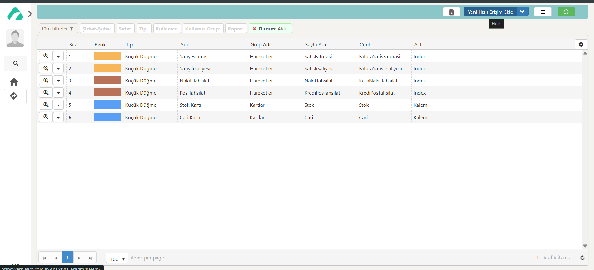
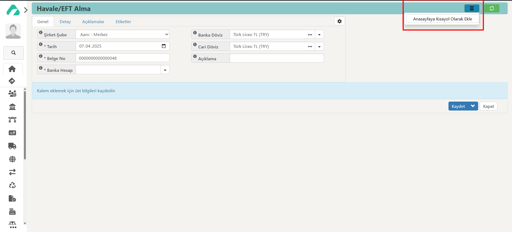

# Kısayollara Ekleme

## Tanım

**Kısayollarım**a ekle özelliği, kullanıcıların sık kullandıkları işlevleri veya sayfaları kişiselleştirilmiş bir menüye ekleyerek kolayca erişmelerini sağlar. 
Bu özellik, kullanıcıların belirli işlem veya sayfalara hızlı bir şekilde ulaşmalarını sağlayarak iş verimliliğini artırır.
Bu menü, ekranın kenar çubuğunda yer almaktadır.
Eklediğiniz kısayolları istediğiniz sıraya göre düzenleyebilir ve yeniden sıralayabilirsiniz. 
Bu, kısayol menüsünün kişisel tercihlere ve kullanım alışkanlıklarına göre özelleştirilmesini sağlar.

## Ulaşım

Ekleme yaptığınız kısayolları görüntülemek, pasife almak ve yeni kısayollar eklemek için Modüller'in yanındaki **Kısayollarım** sekmesini kullanabilirsiniz.

Aşağıdaki gibi yollarla ulaşabilirsiniz:

- Sol sekmede Aaro kullanıcı bilgilerinin hemen altında yer alan **Kısayollarım -> Kısayol Listesi -> Yeni Hızlı Erişim Ekle** ile kısayol ekleme ekranına ulaşım sağlayabilirsiniz.
- **Kısayollarım**a eklemek istediğiniz modülün sayfasını açınız. 

Örneğin, Banka hesap kartı listesini **Kısayollarım**a eklemek istiyorsanız bunun için:
**Modüller -> Banka -> Banka Hesap Kartı Listesi -> Üç işlem butonu -> Ana Sayfaya Kısayol Olarak Ekle**; 

Örneğin, Satış faturasını **Kısayollarım**a eklemek istiyorsunuz:
**Modüller -> Musteri/Satici -> Hareket Oluştur -> Satış Faturası -> Üç işlem butonu -> Ana Sayfaya Kısayol Olarak Ekle** 

**Kısayollarım**da ekli olan bir kart ya da hareketi kapatmak için:
**Aaro -> Kısayollarım -> kaldırmak istediğiniz kısayolun yanındaki büyüteç işaretine tıklayınız ya da o satıra çift tıklayınız -> açılan penceredeki durum kısmını pasif yaparak kısayolunuzun görünürlüğünü kapatın**.

## Kısayollarıma Ekleme Ekranı

**Durum:** Aktif ya da pasiflik durumunu seçebilirsiniz.

**Adı:** Kısayola vermek istediğiniz adlandırmayı yazabilirsiniz.

**Grup Adı:** Hareketler, kartlar gibi gruplandırma yapabilirsiniz. 

**Sıra:** Oluşturacağınız butonun görüntülenme sırası belirlenir. 

**Renk:** Kısayola istediğiniz rengi atayabilirsiniz.

**Link Tipi:** Sayfa ya da rapor olarak seçim yapabilirsiniz.

