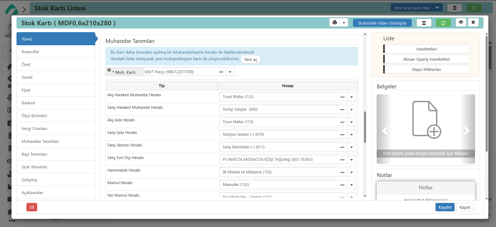

## Muhasebeleşme Tanımları 

Muhasebeleşme, işletme içinde gerçekleşen finansal faaliyetlerin doğru bir şekilde kaydedilmesi, sınıflandırılması ve raporlanması sürecidir. Bu süreç, gelirler, giderler, alacaklar ve borçlar gibi finansal unsurların düzenli bir şekilde takip edilmesini sağlar. Aynı zamanda, yasal mevzuata uygun bir şekilde oluşturulmasına da yardımcı olur.

AARO ERP sisteminin muhasebeleşme modülü, bu süreci otomatikleştirerek finansal operasyonların daha verimli ve hatasız bir şekilde yürütülmesine katkı sağlar.

**Stok kartlarında** muhasebeleşme tanımları, stok hareketlerinin muhasebe kayıtlarına nasıl yansıyacağını belirler. Bu, mal alımı, satışı, ham madde, yarı mamul, mamul, iade veya iskonto gibi işlemlerin doğru muhasebe hesaplarına işlenmesini sağlar. 

Sistemde her bir stok hareketi, otomatik olarak ilgili muhasebe hesabına yönlendirilir. Ancak, farklı muhasebeleşme kodları gerektiğinde manuel olarak değiştirilebilir.
**Bu kodlar üzerinde hesap plan atamaları yaparken mutlaka Mali Müşavirinizden destek alınız.** 

**Demirbaş kartlarında** muhasebeleşme tanımları, sahip olunan demirbaşların finansal muhasebe kayıtlarına doğru bir şekilde yansıyabilmesi için gerekli kayıtların belirlenmesidir. Bu tanımlar, demirbaşların alımı, satımı, amortismanı ve diğer finansal işlemlerinin muhasebe sistemine doğru bir şekilde aktarılmasını sağlar.

**Müşteri/Satıcı cari kartlarında** cariye ait muhabeleşme kodları alış veya satış hareketleri için geçerli olacak finansal muhasebe kayıtlarını ifade eder.
Yeni Müşteri/Satıcı kartı açarken sistem bize carinin müşteri ya da satıcı durumuna göre otomatik hesap kodlarına atama yapar;
Alacak Hesapları: Müşteri borçlarını takip etmek için kullanılır. (Örneğin: 120 - Alıcılar)
Borç Hesapları: Tedarikçilere olan borçları izlemek için kullanılır. (Örneğin: 320 - Satıcılar)
Bu kodlar özel muhasebeleşme kodlarına uygun olacak şekilde revize edilebilir.
**Bu kodlar üzerinde hesap plan atamaları yaparken mutlaka Mali Müşavirinizden destek alınız.**

**Banka Hesap Kartlarında** muhasebeleşme tanımları, banka hesapları üzerinden gerçekleşen finansal işlemlerin muhasebe kayıtlarının doğru ve eksiksiz bir şekilde yansıtılmasını sağlar. 
Banka hesap hareketlerinin ilgili muhasebe hesaplarına otomatik olarak kaydolma olanağı tanınır.
Banka borç, alacak, tahsilde çek ve tahsildeki senet hesabı gibi otomatik hesap kodlarına atama yapar.

 **Mevcuttan Seç** diyerek, mevcut muhasebeleşme kartını seçebilir ve ilgili muhasebeleşme kartlarının sistemde otomatik olarak tanımlanmasını sağlayabilirsiniz.

**Yeni Aç** Yeni aç diyerek yeni muhabeleşme tanımları oluşturabiliriz.

