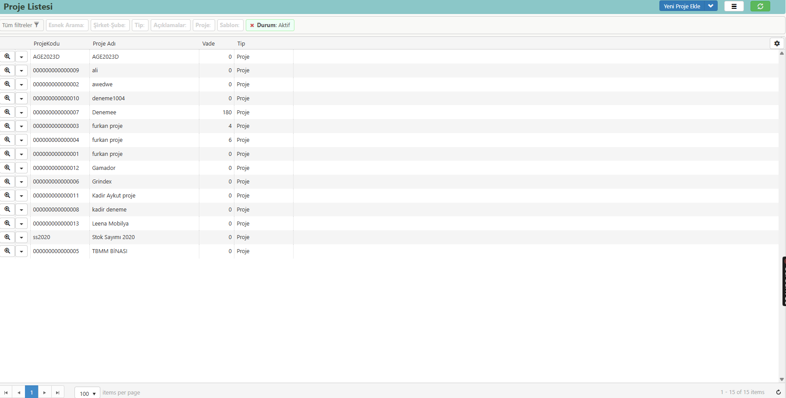

# Proje

**Erişim Linki :** [erp.aaro.com.tr/Proje/Liste](erp.aaro.com.tr/Proje/Liste)

## Ulaşım 

- Sol sekmede Aaro kullanıcı bilgilerinin hemen altında yer alan arama motorundan "proje" aratarak ulaşım sağlayabilirsiniz.
- Sol menüden Ayarlar -> Kartlar -> Proje Listesi şeklinde ulaşım sağlayabilirsiniz.

# Tanım 

Proje; belirli bir amacı gerçekleştirmek için planlanmış, başlangıç ve bitiş tarihleri ile sınırlandırılmış, bir dizi faaliyet ve görevi kapsayan geçici bir girişimdir. 
Projeler, belirli bir hedefe ulaşmak, bir ürün, hizmet veya sonuç üretmek amacıyla organize edilir. 
Her proje, kendine özgü bir kapsam, zaman çizelgesi, kaynak kullanımı ve bütçeye sahiptir. 
Proje yönetimi ise bu süreçleri planlama, yürütme, izleme ve kontrol etme disiplinidir. 

Satış faturaları, siparişler ve diğer işlemlerde, stokların bağlı olduğu projeleri belirlemek, proje yönetiminde büyük bir avantaj sağlar. 
Her bir stok kaleminin hangi projeye ait olduğunu tanımlayarak, o proje kapsamında kullanılan tüm stokların izlenmesini ve yönetilmesini kolaylaştırabilirsiniz. 
Örneğin, bir satış faturasında veya siparişte yer alan ürünlerin projelerle ilişkilendirilmesi, bu ürünlerin hangi proje için temin edildiğini,
hangi projede kullanıldığını ve o projeye ait toplam maliyetleri detaylı bir şekilde görmenizi sağlar.

Bu sistem sayesinde, proje bazlı maliyet analizleri yapmak, kaynakların verimli kullanılmasını sağlamak ve projelerin bütçe dahilinde ilerleyip ilerlemediğini izlemek çok daha kolay hale gelir. 
Ayrıca, proje ilerleyişi sırasında hangi stokların ne zaman ve ne miktarda kullanıldığını takip ederek, stok yönetimini optimize edebilir ve gelecekteki projeler için daha doğru tahminlerde bulunabilirsiniz.

Proje ile entegre edilmiş stok takibi, sadece stokların doğru projelere atanmasını sağlamakla kalmaz, aynı zamanda her projenin ayrıntılı bir dökümünü sunarak,
proje yöneticilerinin daha bilinçli kararlar almasına yardımcı olur. 
Bu entegre sistem, proje süreçlerinin şeffaflığını artırır, raporlama süreçlerini basitleştirir ve iş akışını daha düzenli hale getirir.

## Yeni Proje Ekle 

### Genel 

**Proje Kodu:** Projenin kodunu ifade eder. Sistemin  otomatik kodu kullanabilir ya da manuel proje kodu tanımlanabilir.

**Proje Adı:** Proje adını ifade eder.

**Kodlar:** Projeye ait özel kodlar eklenebilir. İleride gruplu rapor alabilmek için kullanılır. Detaylı anlatıma linkten e4rişim sağlayabilirsiniz. [Kodlar](../TemelOzellikler/Kodlar.md)

**Etiketler:** Projeye ait özel etiketler tanımlanabilir. Kartı gruplamak ve ileride gruplu rapor almak için kullanılır.

### Açıklamalar

**Açıklamalar:** Ek açıklamaları belirtir. [Açıklama](../TemelOzellikler/Aciklama.md)

### Gelişmiş 

**Şirket-Şube:** Kartın ait olduğu şirket ve şubeyi belirtir. Şirket-Şube kullanım detayları için linke tıklayınız. [Şirket-Şube](../TemelOzellikler/SirketSubeKart.md)

**Durum:** Projenin aktiflik ya da pasiflik durumu ifade eder.

**Vade:** Projenin planlanan süre içinde tamamlanabilmesi için bir zaman çizelgesi oluşturur ve tarafların sorumluluklarını zamanında yerine getirmelerini sağlar. Bu, proje yönetiminin etkin bir şekilde yapılmasını ve kaynakların verimli bir biçimde kullanılmasını sağlar.

