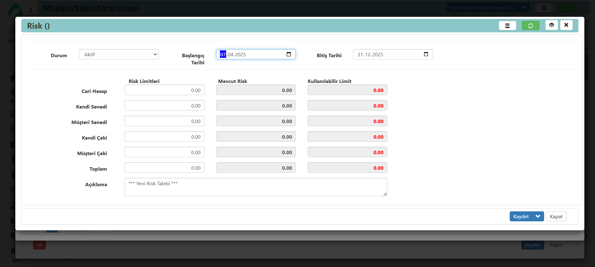

---
SayfaID: CariRiskListesi
SayfaTipi: CariListe
---

# Risk Limitleri

Risk limitleri, finansal riskleri yönetmek amacıyla belirlenen maksimum risk seviyelerini ifade eder. Bu limitler, riskleri kontrol altında tutmayı ve olası zararlardan korunmayı hedefler. Risk limitleri, potansiyel risklere karşı hazırlıklı olmayı ve bu riskleri etkin bir şekilde yönetmeyi sağlar.

Belirlenen limitler, büyük finansal kayıpların veya operasyonel aksaklıkların önüne geçmek için kullanılır. Risk limitleri, yöneticilere risk toleransını belirleme ve stratejik kararlar alma konusunda rehberlik eder. Finansal risk toleransı, yani kabul edilebilir risk seviyesi belirlenir. Bu tolerans, organizasyonun risklere ne kadar dayanabileceğini ve hangi seviyede riski kabul edebileceğini gösterir.

Risk toleransına göre, finansal işlemlerde risk limitleri tanımlanır. Bu limitler, belirli bir risk seviyesinin ötesine geçilmemesi için üst sınırları belirler. Risk limitleri aşıldığında, sistem işlem yapmanıza izin vermez.

Örneğin, bir fatura oluşturduğunuzda sistem kaydetmenize izin verir, ancak risk limitini aştığınızda e-fatura ve e-irsaliye gönderimi başarısız olur.

Başka bir örnek olarak; bir carimiz için toplam risk limiti 100.000 ₺ olarak tanımladık. Carimiz bize 200.000 ₺ ödeme yaptı ve bizden 150.000 ₺ değerinde ürün talebinde bulundu. Ancak carimize tanımlı risk limiti 100.000 ₺ olduğu için sistem, sadece 100.000 ₺ değerinde ürün çıkışı yapmamıza izin verecektir.
Risk limitlerinin uygulanması ve aşılması durumları düzenli olarak raporlanır. Bu raporlar, üst yönetime ve ilgili paydaşlara sunulur.

### Cariye Risk Limit Tanımlama 

Cariye özel risk limitleri tanımlayarak finansal riskleri kontrol edebilir ve sınırları belirleyebilirsiniz.
Bir Carimize risk limitini nasıl tanımlarız;
- *Müşteri/Satıcı -> Müşteri/Satıcı Kartı Listesi -> Cari Seç -> Risk Limitleri* 

Burada cari ile risk limitleri grafiği görüntülenir;

	- **Risk Limitleri Listesi:** Risk Limiti tanımlanan cariler burada görüntülenir.
		Tıklayarak açılan sayfada risk limitleri detayları görüntülenir. Kullanılabilir limit, aşan miktar, mevcutta tanımlı risk limitini görüntülenir.
	- **Yeni Risk Ekle:** Risk tanımlama sayfası görüntülenir;
		- Başlangıç Tarihi - Bitiş Tarihi: Risk limiti için geçerli tarih aralığını belirtir.
		- Cari Hesap: Risk Limitleri  açık hesap ?

		- Kendi Senedi: Kendi senedi ile ilgili risk limitleri, kendi senetleri üzerindeki riskleri kontrol etmek ve yönetmek amacıyla belirlenir.  

		Bu limitler, finansal güvenliği sağlamak için kullanılır.

		- Müşteri Senedi: Bir müşterinin borcunu ödemek üzere verdiği, belirli bir vadeye sahip senettir. 
		Bu senet, müşterinin ödeme yükümlülüğünü garanti altına alır.
		Risk limitlerinde müşteri senedi, bir müşterinin ödeme kapasitesine ve geçmiş ödeme performansına göre belirlenen kredi limitleri içinde değerlendirilir. 
		Müşteri senetlerine tanımlanan limitler, bu senetlerle ilişkili finansal risklerini kontrol etmesine yardımcı olur.

		- Kendi Çeki: Risk limitlerinde, kendi çekleri, kendi adına düzenlediği çeklerle ilgili riskleri yönetmek amacıyla takip edilir. 
		Bu limitler, çek ile ilgili ödeme yükümlülüklerinin kontrol altında tutulmasını sağlar.

		- Müşteri Çeki: Risk limitlerinde müşteri çeki, müşteri tarafından verilen çeklere dayalı olarak aldığı riski ifade eder. 
		Müşteri çeklerine tanımlanan risk limitleri, bu çeklerle ilişkili olası finansal riskleri kontrol etmek amacıyla belirlenir.

		- Toplam: Cari hesaba tanımlanan risk limitleri kapsamında yapılabilecek tüm işlemlerin birikmiş tutarını temsil eder.

	**Kaydet** seçeneği ile risk limiti tanımlama işlemimizi tamamlayabiliriz.

Cariye Risk Limitini tanımladıktan sonra risk limitlerin çalışması için parametre tanımlarımızı yapmamız gerekmektedir.
- *Ayarlar -> Parametre Listesi -> Yeni Parametre Ekle -> Parametre: CariRisk_Calissin (Müşteri/Satıcı Risk Limitleri) -> Değer: Evet -> *Kaydet**  
Carilerimizde Risk Limitlerimizi aktif edilmiştir.

### Raporlar

*Rapor -> Müşteri/Satıcı -> Diğer -> Cari Risk Listesi*
	Özel filtrelemeler yaparak risk limitleri raporlarına ulaşabiliriz. 
	Cari bazında veya tutarlara göre analiz raporlarına erişim sağlayarak detaylı inceleme yapabiliriz.
