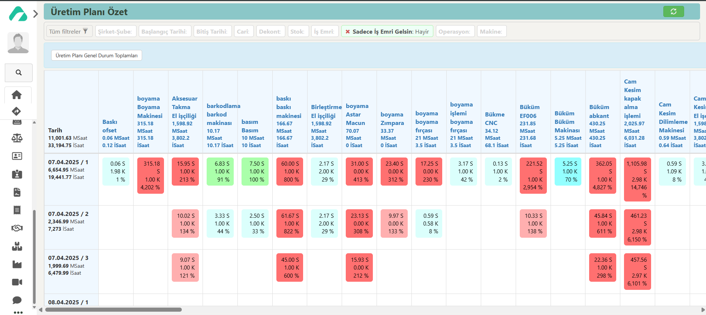

# Otomatik Planlama

Otomatik planlama istem tarafından kullanılacak olan verilerin toplanmasıyla başlar.
Veriler üretim planı, stok seviyeleri, tedarikçi bilgileri, talep tahminleri gibi çeşitli kaynaklardan gelir. 
Veriler daha sonra analiz edilir ve işlenir.  
Otomatik planlama süreci, üretilecek ürünlerin bileşenlerini, her bir ürün için hangi malzemelerin gerektiğini, bu malzemelerin hangi tedarikçilerden temin edileceği gibi bilgileri belirler.  
Mevcut makine ve işgücü kapasiteleri göz önüne alınarak, belirli bir zaman diliminde hangi ürünlerin ne kadarının üretilebileceğini hesaplar.  
Otomatik planlama işlem süresi için takvim - personel kartıyla eşleştirir. 

Takvime göre, diyelim ki;  
A tarihinde 540 dk çalışılır,  
B tarihinde 450 dk çalışılır,  
C tarihinde çalışılmaz.   
İşçi takvimi girilir, elimizdeki verilerde yer alan saatlere göre otomatik planlama yapılır.
Otomatik planlama boşta olan her makineyi değerlendirerek alternatif makinelere eşit şekilde işi dağıtır.

Vardiyaları parametreler kısmından değiştirebilir, 2 ya da 3 vardiya olarak değişiklik yapabiliriz.

Vardiya parametresine ulaşım için;
Sol sekmeden *Modüller -> Ayarlar -> Parametre Listesi -> Uretim_VardiyaSayisi -> Büyüteç -> Değer* şeklinde veri değişikliği yapabilirsiniz.     
Kaç vardiya çalıyor iseniz; normal ise 1, 2 vardiya çalışıyorsanız 2, 3 vardiyalı çalışıyorsanız 3 değerini girerek vardiyanızı seçebilirsiniz.

Otomatik planlama süreci sonunda elde edilen planlama sonuçları değerlendirilir. 
Bu değerlendirme, planlama hedeflerinize ne kadar uygun olduğunu, maliyet etkinliğini ve diğer performans ölçütlerini içerir.
Otomatik planlamanın oluştuğu takvimde planlama değişikliği yapabilirsiniz.

[İş Emri Ekleme](../Uretim/YeniIsEmri.md) yaparak otomatik planlamaya ulaşım sağlayabilirsiniz. 
