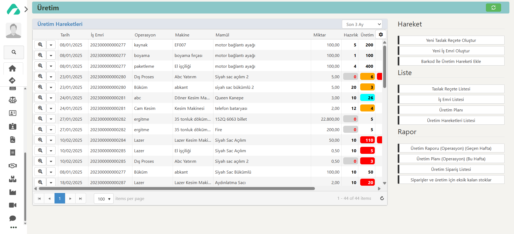

# Üretim

**Erişim Linki :** [erp.aaro.com.tr/UretimModulu](erp.aaro.com.tr/UretimModulu)

## Ulaşım

- Sol sekmede Aaro kullanıcı bilgilerinin hemen altında yer alan arama motorundan "Üretim" şeklinde aratarak ulaşım sağlayabilirsiniz.
- Sol menüden Üretim -> Üretim Modülü şeklinde ulaşım sağlayabilirsiniz. 

## Tanım 

Üretim, mal ve hizmetlerin ekonomik değer yaratmak amacıyla dönüştürülmesi sürecidir.  
Doğal kaynaklar, iş gücü, sermaye ve teknoloji gibi üretim faktörlerini kullanarak ham maddelerin nihai ürünlere veya hizmetlere dönüştürülmesini içerir.    
Üretim, tarım, imalat, inşaat ve hizmet  sektörlerinde gerçekleşebilir.   
Ekonomik büyüme, istihdam yaratma ve yaşam standartlarının yükseltilmesi açısından kritik bir rol oynar. 

# Üretim Modülü 

Modül Sayfasında, hareket ekleme, listeler, raporlar ve üretim hareketlerine kolayca ulaşım sağlayabilirsiniz.

Üretim modülü, ürünlerin üretim süreçlerini, aşamalarını planlamak, yönetmek ve izlemek için kullanılır.
Üretim sürecinin başlangıçını reçete oluşturmaktadır. 

[Reçete](../Uretim/Recete.md) bir ürünün yapımında kullanılan malzemenin ve bu malzemlerin hangi oranlarda ve nasıl kullanılacağının belirtildiği bir belgedir.

[Makine](../Uretim/MakineListesi.md) bir üretim tesisinde kullanılan herhangi bir makineyi ifade eder, ürünün veya bileşenin üretiminde kullanılan herhangi bir ekipman olabilir.   
Üretim makineleri, üretim hattında farklı işlevlere sahip olabilir;   
bazıları ham maddeleri işleyebilir, bazıları montaj yapabilir, bazıları test edebilir ve diğerleri ise ambalajlama gibi son işlemleri gerçekleştirebilir.

[Operasyon](../Uretim/OperasyonListesi.md) bir üretim sürecinin belirli bir aşamasında gerçekleştirilen belirli bir faaliyetti 
Operasyon, ham maddelerin işlenmesi, parçaların montajı, ürünlerin test edilmesi gibi çeşitli işlemleri içerebilir.   
Operasyonlar genellikle belirli bir ürün veya hizmetin üretimini tamamlamak için gerekli adımları içeren bir operasyonel planın parçasıdır.

Reçeler, Makineler ve Operasyonlar hazırlandıktan sonra ikinci aşama iş emridir.

[İş Emri](../Uretim/IsEmri.md) bir işin yapılması için çalışanlara veya birimlere verilen talimatlardır. 
İş emri bir işin ne zaman, nerede, nasıl ve kim tarafından yapılacağını belirtir.
Her bir operasyon ve ürünler(reçeteler) iş emrinde aşamalı olarak yer alması gerekmektedir.

İş emirleri tamamlandıktan sonraki aşama planlama aşamasıdır.

Planlama, işletmenizin belirli bir zaman diliminde hangi ürünleri ne zaman, ne kadar ve hangi kaynaklarla üreteceğinizi planlama sürecidir.   
Üretim faaliyetlerini etkin bir şekilde organize etmeyi ve kaynakların en verimli şekilde kullanılmasını sağlar.  
Üretim planlamasının amacı, üretim süreçlerini optimize ederek stok maliyetlerini düşürmek, teslimat sürelerini iyileştirmek, müşteri taleplerini karşılamak ve işletme verimliliğini artırmaktır.   
Üretim planlaması, işletmenizin mevcut üretim kapasitesini ve kaynaklarını değerlendirir.   
Makine kapasitesi, işçi sayısı, malzeme stokları ve diğer üretim kaynaklarını içerir.  
Üretim planlaması, malzeme ihtiyaçlarını belirlemek için malzeme ihtiyaçları planlaması (MRP) yöntemini kullanır.   
MRP, üretim sürecinin her aşamasında hangi malzemelerin ne zaman ve ne kadar gerektiğini hesaplar.   
Aynı zamanda üretim yapılırken canlı takip etme olanağınız mevcuttur. İşçi ne zaman ara verdi, ne zaman başladı gibi süreçleri izleyebilirsiniz.

Üretim Aşamasında, canlı takip ve sonradan manuel olarak iki şekilde giriş yapılmaktadır. 

[Canlı Üretim Terminali](../Uretim/Terminal.md) üretim süreçlerini izlemek, yönetmek ve kontrol etmek için kullanılan bir araçtır. 
Canlı üretim terminali, fabrika veya üretim tesisindeki üretim faaliyetlerini gerçek zamanlı olarak takip etmeyi ve yönetmeyi sağlar. 

Bir diğer alternatif olarak üretim bittikten sonra [Üretim Hareketi Girişi](../Uretim/HizliUretimHareketi.md) manuel giriş yapabilirsiniz.
   Üretim hareketlerini manuel girdiğiniz taktirde;
[İş Emri Çıktı](../Uretim/IsEmriCıktı.md)sını alarak üretimden sorumlu usta başı buradan bütün aşamaları görecek şekilde çıktı alabilir.  
Her bir operasyon için sorumlu olacak personeller için [Operasyon Çıktısı](../Uretim/OperasyonCikti.md) alarak personellere iş emri verebilir.

Planlama üretim tanımları sipariş teslim tarihi gibi veriler girildiğinde otomatik planlama oluşturur.  
[Otomatik Planlama](../Uretim/OtomatikPlanlama.md) sisteminin oluşturduğu otomatik planlamayı kullanabilir, değişiklik yapabilirsiniz.   
Otomatik planlama alternatif makineleri değerlendirerek bir plan oluşturur. Kullanıma uygun kaç makine var ise operasyonu hepsini eşit şekilde dağıtır. 

Üretim yapılırken aynı zamanda stoğumuzu da yönetebiliriz.  
[MRP](../Uretim/Mrp.md) malzeme gereksinim planlaması takip etmemize, konrrol altında tutmamıza ve eksilen ürünler ham maddelere müdahale etmemize yardımcı olur.   
Üretim için gerekli miktarları hesaplar, hesaplama yaparken depoda bulunması gereken miktarları ve üretilirken ne kadar gerekli olduğunu gösterir.  
Bu şekilde eksik olan ham madde, yarı mamul ve mamullerin tedariğini kolayca sağlayabiliriz.

# Maliyet Hesaplamaları 

Üretim sürecinde işletmenizin için en önemli detaylardan biri de maliyet hesaplamalarıdır.
İşlemenizin üretim faaliyetlerini takip ederken maliyetlerinide kontrol edebilirsiniz.
Üretim maliyetlerini hesaplayarak ürünlerinin fiyatlandırmasını ve kar oranlarınızı hesaplamanız kolaylaşır.

## İşçilik Maliyeti 

Üretim sürecinde çalışan işçilerin çalışma maliyetleridir. Detaylı bilgi için tıklayınız. [İşçilik Maliyeti](../Uretim/İscilikMaliyeti.md)

## Birim Maliyeti

Makine masraflarının hesapları ve işçilik hesaplarının toplamıdır. Detaylı bilgi için tıklayınız. [Çalışma Mal. / Saat](../Uretim/BirimMaliyeti.md)

