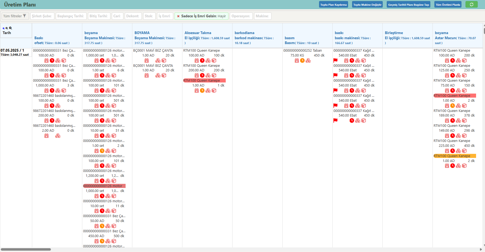

# Üretim Planı

**Erişim Linki :** [erp.aaro.com.tr/UrIsEmriPlan/PlanDetay](erp.aaro.com.tr/UrIsEmriPlan/PlanDetay)

### Ulaşım

- Sol sekmede Aaro kullanıcı bilgilerinin hemen altındaki arama motorundan "Üretim Planı" şeklinde aratarak ulaşabilirsiniz.
- Sol menüden *Üretim -> Listeler -> İş Emri Listesi -> İş Emrini Aç -> Plan Göster* şeklinde ulaşabilirsiniz.
- Sol menüden *Üretim -> Listeler -> Üretim Planı* şeklinde ulaşabilirsiniz.

### Tanım

Üretim planı, bir işletmenin üretim yapacağı ürünleri, kullanılacak ham madde miktarını, üretim sürecinin zamanlamasını ve kaynak dağılımını içeren bir planlama belgesidir.   
Bu plan, üretim sürecinin verimli bir şekilde yönetilmesini sağlar ve işletmenizin hedeflerine ulaşmasına yardımcı olur.

Burada planlamalarda değişiklik yapmak için sürükleyerek kolayca değişiklik yapabiliriz.  
Üretim süreçlerinin ne zaman ve hangi sırayla gerçekleşeceğini görüntüleyebiliriz.   
Makine ve iş gücü gibi kaynakların en verimli şekilde kullanılması hedeflenir.  
Üretim planında, üretim planınızı görüntüleyerek üretim planlamalarınızı yapabilirsiniz.  
Makine doluluk oranını görüntüleyebilir, iş yükünü değerlendirerek yeni düzenlemeler yapabilirsiniz.

Üretim planında makinelerimizin iş yoğunluğunda değişiklik yapabiliriz.  
Yeni üretim girişi yapabilir, parçalayabilir, üretilen miktarı görüntüleyebilir, çıktı alabilir, iş emri, sipariş detaylarını görüntüleyebilir ve makine değişikliği yapabiliriz. 
Bu işlemleri nasıl gerçekleştirdiğimizin detaylarına linkten erişim sağlayabilirsiniz. [Üretim Planı Ek İşlemler](../Uretim/UretimPlaniEkIslemleri.md)

### Ek Özellikler 

- Sayfanın üst kısmında bulunan [Filtreleme](../TemelOzellikler/SayfaKisitlari.md) özelliği ile gelen veriyi istediğiniz şekilde sınırlandırabilirsiniz.
	
Tarih, cari, iş emri, operasyon, makineye göre filtreleme yaparak istediğimiz verilere kolayca erişim sağlayabiliriz.
Filtrelemede Sadece İş Emri Gelsin;
	
**Evet** seçeneği seçili olduğunda sadece iş emirlerini görüntüleriz.

**Hayır** seçeneği seçili olduğunda set ve süreler gözükmektedir.
	
İş emirlerinize tıklayarak yeni üretim girişi yapabilir, üretilen setleri görüntüleyebilir, parçalayabilir, iş emrine erişebilir, makine değiştirebilir, üretime ait çıktılar alabilirsiniz.

### Toplu Plan Kaydırma

Üretim planlarında esneklik sağlayarak, beklenmedik durumlara hızlıca adapte olmayı mümkün kılar.

**Tarih:** İşlem yapılacak tarihi seçelim.

**Ertelenecek Gün Sayısı:** Üretim planımızı erteleyeceğimiz gün sayısını girelim.

Örneğin, bugün üretim planımızda koltuk takımı rutin üretimi bulunuyor, ancak acil bir iş geldi ve 3 gün içinde teslim edilmesi gerekiyor. Ertelenecek gün sayısına 3 yazarak, acil işimizi bitirdikten sonra üretime kaldığımız yerden devam edebiliriz.

**İş Emri:** Ertelenecek olan iş emrini seçelim.

**Şirket-Şube:** Kartın ait olduğu şirket ve şubeyi belirtir. Şirket-Şube kullanım detayları için linke tıklayınız. [Şirket-Şube](../TemelOzellikler/SirketSubeKart.md)

**Operasyon:** Ertelenecek operasyonu seçelim.

**Makine:** Makineyi seçelim.

### Toplu Makine Değiştir

**Toplu Makine Değiştir** işlemi, belirli üretim süreçlerinde kullanılan makinelerin toplu olarak değiştirilmesi veya güncellenmesi gereken durumlarda kullanılan bir fonksiyondur.   
Üretim süreçlerinde esneklik ve verimlilik sağlar ve makine arızaları, bakım ihtiyaçları veya kapasite değişiklikleri gibi durumlara hızlı bir şekilde adapte olmayı mümkün kılar.  
Üretim hattındaki makinelerin değiştirilmesi gereken yerler ve bu değişikliğin üretim süreçlerine etkisini analiz edebilirsiniz.   
Hangi makinelerin hangi üretim emirlerinde kullanıldığı ve bu değişikliğin ne tür bir etki yaratacağı belirleyebilirsiniz.

**Başlangıç Tarihi:** Makine değişikliğinin başlayacağı tarihi seçelim.

**Operasyon:** Hangi operasyonda makine değişikliği yapılacaksa o operasyonu seçelim.

**Kaynak Makine:** Operasyonda değişim yapacağımız makineyi seçelim.

**Bitiş Tarihi:** Makine değişikliğinin biteceği tarihi seçelim.

**Şirket-Şube:** Kartın ait olduğu şirket ve şubeyi belirtir. Şirket-Şube kullanım detayları için linke tıklayınız. [Şirket-Şube](../TemelOzellikler/SirketSubeKart.md)

**Hedef Makine:** Operasyonda değişim sonrası kullanılacak makineyi seçelim.

### Geçmiş Tarihli Planı Bugüne Taşı 

**Geçmiş Tarihli Planı Bugüne Taşı** işlemi, planlanmış ancak belirli bir nedenle gerçekleştiremediğimiz üretim faaliyetlerini yeniden planlanarak bugüne alınmasıdır.   
Bu işlem, özellikle üretim süreçlerinde gecikmelerin telafi edebilmemiz ve üretim hedeflerinin zamanında gerçekleştirebilmemiz için önemlidir.  
Geçmiş tarihteki üretim emirleri, mevcut üretim planına eklenir.   
İşlerin ne zaman ve hangi sırayla yapılacağı belirlenir.   
Üretim takvimi, mevcut kaynakları en verimli kullanılacak şekilde güncellenir.

**Şirket-Şube:** Hareketin ait olduğu şirket ve şubeyi belirtir. Şirket-Şube kullanım detayları için linke tıklayınız. [Şirket-Şube](../TemelOzellikler/SirketSubeHareket.md)

### Tüm Üretimi Planla

Hazır olan tüm iş emirlerinin otomatik planlamasının yapılmasıdır.    
Alternatif makineleri değerlendirerek en uygun üretim planını hazırlar.  
İşlem yaptığımız gün itibariyle tüm üretimi, teslim tarihi ve önceliklere göre otomatik olarak planlayacaktır.

**Şirket-Şube:** Hareketin ait olduğu şirket ve şubeyi belirtir. Şirket-Şube kullanım detayları için linke tıklayınız. [Şirket-Şube](../TemelOzellikler/SirketSubeHareket.md)

**Plan Başlangıç Tarihi:** Planlamaya hangi gün başlayacaksak tarihini girelim.

**Plan Başlangıç Vardiya:** Plana başladığımızda kaçıncı vardiyada isek o vardiyayı seçelim.

**Alternatif Makineleri Değerlendir:** Bu seçeneği aktif ederek alternatif makineleri değerlendirip en uygun planlamayı yapar.

**Minimum Bir Güne Planlanabilecek Miktar:** Bir gün için en düşük ne kadar ürün çıkaracaksak minimum ürünün miktarını girelim.

**Minimum Bir Güne Planlanabilecek Süre Dk:** Bir gün için en az ne kadar sürede planlama yapılmasını istiyorsak minimum süreyi girelim.

*Kaydet* butonuna basarak planlamamızı gerçekleştirebiliriz.
